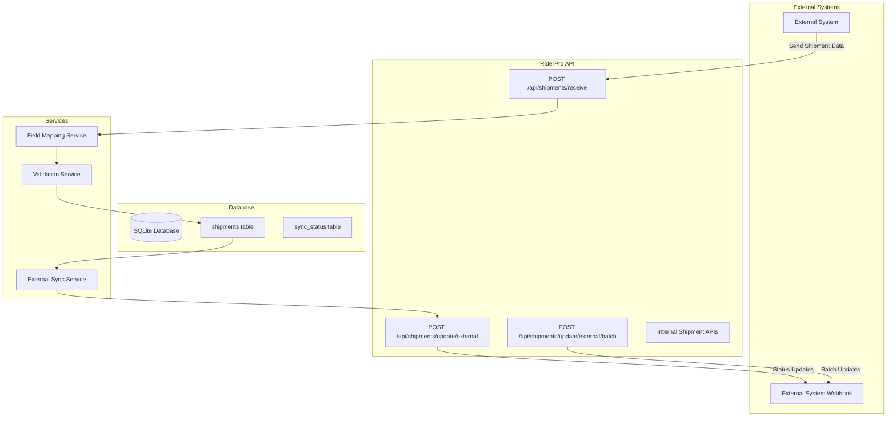

# Design Document

## Overview

This design addresses the critical misalignment between the RiderPro API implementation, database schema, and documentation for external system integration. The analysis reveals several key issues:

1. **Field Mapping Issues**: External payload field names need proper mapping to existing database schema
2. **Missing External Endpoints**: No dedicated endpoints for receiving external shipment data
3. **Missing Database Fields**: Some required fields are missing from the current database schema
4. **Documentation Inaccuracy**: API documentation doesn't reflect actual implementation or requirements
5. **Performance Issues**: Excessive health check calls causing system performance problems

## Architecture

### Current State Analysis

**Database Schema (server/db/connection.ts):**
```sql
CREATE TABLE shipments (
  id TEXT PRIMARY KEY,                    -- ✓ Will be used as external tracking ID
  type TEXT NOT NULL,                     -- ✓ Matches requirement  
  customerName TEXT NOT NULL,             -- ✓ Maps to recipientName in external payload
  customerMobile TEXT NOT NULL,           -- ✓ Maps to recipientPhone in external payload
  address TEXT NOT NULL,                  -- ✓ Maps to deliveryAddress in external payload
  latitude REAL,                          -- ✓ Matches requirement
  longitude REAL,                         -- ✓ Matches requirement
  cost REAL NOT NULL,                     -- ✓ Matches requirement
  deliveryTime TEXT NOT NULL,             -- ✓ Maps to estimatedDeliveryTime in external payload
  routeName TEXT NOT NULL,                -- ✓ Matches requirement
  employeeId TEXT NOT NULL,               -- ✓ Matches requirement
  status TEXT NOT NULL DEFAULT 'Assigned' -- ✓ Matches requirement
  -- MISSING: priority, pickupAddress, weight, dimensions, 
  --          specialInstructions, actualDeliveryTime
)
```

**Current API Endpoints (server/routes.ts):**
- ✅ `GET /api/shipments` - Exists for listing
- ✅ `POST /api/shipments` - Exists but for internal creation, not external reception
- ❌ `POST /api/shipments/receive` - Missing for external data reception
- ❌ `POST /api/shipments/update/external` - Missing for sending updates to external systems

### Target Architecture



## Components and Interfaces

### 1. Database Schema Updates

**Required Schema Changes:**
```sql
-- Add missing columns to shipments table
ALTER TABLE shipments ADD COLUMN priority TEXT;
ALTER TABLE shipments ADD COLUMN pickupAddress TEXT;
ALTER TABLE shipments ADD COLUMN weight REAL;
ALTER TABLE shipments ADD COLUMN dimensions TEXT;
ALTER TABLE shipments ADD COLUMN specialInstructions TEXT;
ALTER TABLE shipments ADD COLUMN actualDeliveryTime TEXT;

-- Create indexes for external integration
CREATE INDEX IF NOT EXISTS idx_shipments_priority ON shipments(priority);
CREATE INDEX IF NOT EXISTS idx_shipments_pickup ON shipments(pickupAddress);
```

### 2. External Data Reception API

**Endpoint:** `POST /api/shipments/receive`

**Input Interface:**
```typescript
interface ExternalShipmentPayload {
  // Single shipment format - using existing database field names
  id: string;                    // External tracking ID (maps to database id)
  status: string;
  priority: string;
  type: string;
  pickupAddress: string;
  deliveryAddress: string;       // Maps to address in database
  recipientName: string;         // Maps to customerName in database
  recipientPhone: string;        // Maps to customerMobile in database
  weight: number;
  dimensions: string;
  specialInstructions?: string;
  estimatedDeliveryTime: string; // Maps to deliveryTime in database
  customerName: string;          // Same as recipientName for compatibility
  customerMobile: string;        // Same as recipientPhone for compatibility
  address: string;               // Same as deliveryAddress
  latitude: number;
  longitude: number;
  cost: number;
  deliveryTime: string;          // Same as estimatedDeliveryTime
  routeName: string;
  employeeId: string;
}

interface ExternalShipmentBatch {
  // Array format
  shipments: ExternalShipmentPayload[];
  metadata?: {
    source: string;
    batchId: string;
    timestamp: string;
  };
}
```

**Response Interface:**
```typescript
interface ShipmentReceptionResponse {
  success: boolean;
  message: string;
  results: {
    total: number;
    created: number;
    updated: number;
    failed: number;
    duplicates: number;
  };
  processedShipments: Array<{
    piashipmentid: string;
    internalId: string;
    status: 'created' | 'updated' | 'failed';
    message: string;
  }>;
  timestamp: string;
}
```

### 3. External Update Sending API

**Endpoints:**
- `POST /api/shipments/update/external` - Single update
- `POST /api/shipments/update/external/batch` - Batch updates

**Output Interface:**
```typescript
interface ExternalUpdatePayload {
  piashipmentid: string;
  status: string;
  statusTimestamp: string;
  location?: {
    latitude: number;
    longitude: number;
    accuracy?: number;
  };
  employeeId: string;
  employeeName?: string;
  deliveryDetails?: {
    actualDeliveryTime?: string;
    recipientName?: string;
    deliveryNotes?: string;
    signature?: string;
    photo?: string;
  };
  routeInfo?: {
    routeName: string;
    sessionId?: string;
    totalDistance?: number;
    travelTime?: number;
  };
}
```

### 4. Field Mapping Service

**Purpose:** Handle conversion between internal database fields and external API format

```typescript
class FieldMappingService {
  // Convert external payload to internal database format
  mapExternalToInternal(external: ExternalShipmentPayload): InternalShipment {
    return {
      id: generateInternalId(),
      piashipmentid: external.piashipmentid,
      type: external.type,
      customerName: external.customerName,
      customerMobile: external.customerMobile,
      address: external.address,
      latitude: external.latitude,
      longitude: external.longitude,
      cost: external.cost,
      deliveryTime: external.deliveryTime,
      routeName: external.routeName,
      employeeId: external.employeeId,
      status: external.status,
      priority: external.priority,
      pickupAddress: external.pickupAddress,
      deliveryAddress: external.deliveryAddress,
      recipientName: external.recipientName,
      recipientPhone: external.recipientPhone,
      weight: external.weight,
      dimensions: external.dimensions,
      specialInstructions: external.specialInstructions,
      estimatedDeliveryTime: external.estimatedDeliveryTime,
      createdAt: new Date().toISOString(),
      updatedAt: new Date().toISOString()
    };
  }

  // Convert internal database format to external update format
  mapInternalToExternal(internal: InternalShipment): ExternalUpdatePayload {
    return {
      piashipmentid: internal.piashipmentid,
      status: internal.status,
      statusTimestamp: internal.updatedAt,
      location: {
        latitude: internal.latitude,
        longitude: internal.longitude
      },
      employeeId: internal.employeeId,
      deliveryDetails: {
        actualDeliveryTime: internal.actualDeliveryTime,
        recipientName: internal.recipientName
      },
      routeInfo: {
        routeName: internal.routeName
      }
    };
  }
}
```

### 5. External Sync Service Enhancement

**Purpose:** Handle webhook communication with external systems

```typescript
class ExternalSyncService {
  async sendUpdateToExternal(update: ExternalUpdatePayload): Promise<boolean> {
    // Send single update to external system webhook
  }

  async sendBatchUpdatesToExternal(updates: ExternalUpdatePayload[]): Promise<BatchSyncResult> {
    // Send batch updates to external system webhook
  }

  async receiveFromExternal(payload: ExternalShipmentPayload | ExternalShipmentBatch): Promise<ShipmentReceptionResponse> {
    // Process incoming shipment data from external systems
  }
}
```

## Data Models

### Updated Shipment Schema

```typescript
interface CompleteShipment {
  // Internal fields
  id: string;                    // Internal UUID
  createdAt: string;
  updatedAt: string;
  
  // External integration fields
  piashipmentid: string;         // External system tracking ID
  status: string;                // Assigned, In Transit, Delivered, etc.
  priority: string;              // high, medium, low
  type: string;                  // delivery, pickup
  
  // Address fields
  pickupAddress: string;
  deliveryAddress: string;
  address: string;               // Alias for deliveryAddress
  
  // Contact fields
  recipientName: string;
  recipientPhone: string;
  customerName: string;
  customerMobile: string;
  
  // Package fields
  weight: number;
  dimensions: string;
  specialInstructions?: string;
  cost: number;
  
  // Location fields
  latitude: number;
  longitude: number;
  
  // Timing fields
  estimatedDeliveryTime: string;
  deliveryTime: string;          // Alias for estimatedDeliveryTime
  actualDeliveryTime?: string;
  
  // Assignment fields
  routeName: string;
  employeeId: string;
}
```

## Error Handling

### Validation Errors
```typescript
interface ValidationError {
  field: string;
  value: any;
  message: string;
  code: string;
}

interface ValidationResult {
  isValid: boolean;
  errors: ValidationError[];
  sanitizedData?: any;
}
```

### External Communication Errors
```typescript
interface ExternalSyncError {
  type: 'network' | 'validation' | 'authentication' | 'rate_limit';
  message: string;
  retryable: boolean;
  retryAfter?: number;
}
```

## Testing Strategy

### Unit Tests
1. **Field Mapping Service Tests**
   - Test external to internal mapping
   - Test internal to external mapping
   - Test edge cases and null values

2. **Validation Service Tests**
   - Test payload validation
   - Test field constraints
   - Test error message generation

3. **Database Schema Tests**
   - Test migration scripts
   - Test index creation
   - Test constraint validation

### Integration Tests
1. **API Endpoint Tests**
   - Test `/api/shipments/receive` with single shipment
   - Test `/api/shipments/receive` with batch shipments
   - Test external update endpoints
   - Test error handling and validation

2. **External System Integration Tests**
   - Mock external system webhooks
   - Test webhook authentication
   - Test retry mechanisms
   - Test batch processing

### End-to-End Tests
1. **Complete Flow Tests**
   - External system sends shipment data
   - Data is processed and stored
   - Status updates are sent back to external system
   - Error scenarios and recovery

## Implementation Phases

### Phase 1: Database Schema Updates
- Add missing columns to shipments table
- Create migration scripts
- Update indexes
- Test data integrity

### Phase 2: Field Mapping Service
- Implement mapping functions
- Add validation logic
- Create unit tests
- Handle edge cases

### Phase 3: External Reception API
- Implement `/api/shipments/receive` endpoint
- Add payload validation
- Implement batch processing
- Add error handling

### Phase 4: External Update API
- Implement update sending endpoints
- Add webhook functionality
- Implement retry mechanisms
- Add monitoring and logging

### Phase 5: Documentation Updates
- Update API documentation
- Add integration examples
- Document error codes
- Create integration guides