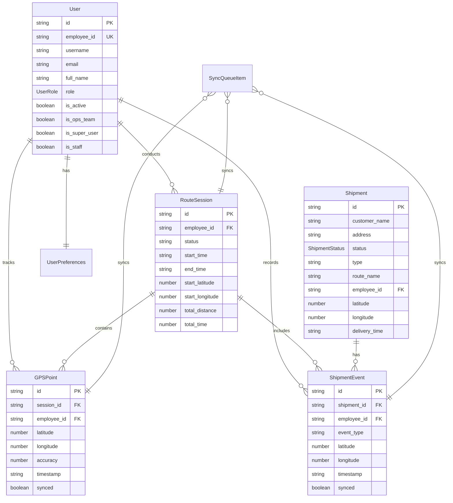

# Database Schema Documentation

## Overview

RiderPro uses a multi-database architecture with SQLite databases for
server-side persistence and IndexedDB for client-side offline functionality. The
system has been redesigned to use three distinct SQLite databases for optimal
performance and data management.

## Database Architecture

### Server-Side Storage (SQLite)

The server uses three separate SQLite databases for different purposes:

#### 1. Main Database (`main.db`)

- **Purpose**: Primary operational database for daily operations
- **Cleanup**: Daily cleanup script removes old data
- **Tables**: All operational tables (shipments, routes, tracking, etc.)

#### 2. Replica Database (`replica.db`)

- **Purpose**: Backup and data retention
- **Retention**: Maintains data for minimum 3 days
- **Tables**: Mirrored structure of main database

#### 3. User Data Database (`userdata.db`)

- **Purpose**: User profiles and local authentication
- **Tables**: rider_accounts, user_preferences
- **Security**: Isolated from operational data
- **Authentication**: Role-based permissions using existing `role` column
- **Token Management**: No database token storage (localStorage only)

### Client-Side Storage (IndexedDB)

The client uses IndexedDB for offline-first functionality, storing GPS data,
route sessions, and sync queues locally.

#### Database: `RouteTrackingOffline`

**Version**: 1 **Stores**: `gpsRecords`, `routeSessions`

## SQLite Database Schema

### Main Database Tables (main.db)

#### Shipments Table (Consolidated)

The shipments table has been consolidated to include acknowledgment and sync
status fields directly, eliminating the need for separate tables.

```sql
CREATE TABLE shipments (
  shipment_id TEXT PRIMARY KEY,
  type TEXT NOT NULL CHECK(type IN ('delivery', 'pickup')),
  customer_name TEXT NOT NULL,
  customer_mobile TEXT NOT NULL,
  address TEXT NOT NULL,
  latitude REAL,
  longitude REAL,
  cost REAL NOT NULL,
  delivery_time TEXT NOT NULL,
  route_name TEXT NOT NULL,
  employee_id TEXT NOT NULL,
  status TEXT NOT NULL DEFAULT 'Assigned' CHECK(status IN ('Assigned', 'In Transit', 'Delivered', 'Picked Up', 'Returned', 'Cancelled')),
  priority TEXT DEFAULT 'medium',
  pickup_address TEXT,
  weight REAL DEFAULT 0,
  dimensions TEXT,
  special_instructions TEXT,
  actual_delivery_time TEXT,
  -- Tracking fields
  start_latitude REAL,
  start_longitude REAL,
  stop_latitude REAL,
  stop_longitude REAL,
  km_travelled REAL DEFAULT 0,
  -- Sync tracking (consolidated from sync_status table)
  synced_to_external BOOLEAN DEFAULT 0,
  last_sync_attempt TEXT,
  sync_error TEXT,
  sync_status TEXT DEFAULT 'pending' CHECK(sync_status IN ('pending', 'success', 'failed')),
  sync_attempts INTEGER DEFAULT 0,
  -- Acknowledgments (consolidated from acknowledgments table)
  signature_url TEXT,
  photo_url TEXT,
  acknowledgment_captured_at TEXT,
  -- Timestamps
  created_at TEXT DEFAULT (datetime('now')),
  updated_at TEXT DEFAULT (datetime('now'))
);
```

#### Route Sessions Table

```sql
CREATE TABLE route_sessions (
  id TEXT PRIMARY KEY,
  employee_id TEXT NOT NULL,
  start_time TEXT NOT NULL,
  end_time TEXT,
  status TEXT NOT NULL CHECK(status IN ('active', 'completed', 'paused')),
  start_latitude REAL NOT NULL,
  start_longitude REAL NOT NULL,
  end_latitude REAL,
  end_longitude REAL,
  total_distance REAL,
  total_time INTEGER,
  vehicle_type TEXT,
  route_name TEXT,
  created_at TEXT DEFAULT (datetime('now')),
  updated_at TEXT DEFAULT (datetime('now'))
);
```

#### Route Tracking Table

```sql
CREATE TABLE route_tracking (
  id TEXT PRIMARY KEY,
  session_id TEXT NOT NULL,
  employee_id TEXT NOT NULL,
  latitude REAL NOT NULL,
  longitude REAL NOT NULL,
  accuracy REAL,
  speed REAL,
  heading REAL,
  timestamp TEXT NOT NULL,
  date TEXT NOT NULL,
  created_at TEXT DEFAULT (datetime('now')),
  FOREIGN KEY (session_id) REFERENCES route_sessions (id)
);
```

#### Vehicle Types Table

```sql
CREATE TABLE vehicle_types (
  id TEXT PRIMARY KEY,
  name TEXT NOT NULL,
  description TEXT,
  icon TEXT DEFAULT 'car',
  fuel_type TEXT DEFAULT 'petrol',
  co2_emissions REAL,
  created_at TEXT DEFAULT (datetime('now')),
  updated_at TEXT DEFAULT (datetime('now'))
);
```

#### Fuel Settings Table

```sql
CREATE TABLE fuel_settings (
  id TEXT PRIMARY KEY,
  fuel_type TEXT NOT NULL DEFAULT 'petrol',
  price_per_liter REAL NOT NULL,
  currency TEXT DEFAULT 'USD',
  region TEXT,
  effective_date TEXT NOT NULL,
  is_active BOOLEAN DEFAULT 1,
  created_by TEXT,
  created_at TEXT DEFAULT (datetime('now')),
  updated_at TEXT DEFAULT (datetime('now'))
);
```

**Purpose**: Stores fuel price settings for different fuel types and regions to
enable accurate route cost calculations and analytics.

**Key Features**:

- Supports multiple fuel types (petrol, diesel, electric, hybrid)
- Regional pricing support for different markets
- Effective date tracking for price history
- Active/inactive status for price management
- Currency support (defaults to USD, configurable to INR)

#### System Health Metrics Table

```sql
CREATE TABLE system_health_metrics (
  id TEXT PRIMARY KEY,
  metric_name TEXT NOT NULL,
  metric_value REAL NOT NULL,
  timestamp TEXT NOT NULL,
  details TEXT
);
```

#### Feature Flags Table

```sql
CREATE TABLE feature_flags (
  id TEXT PRIMARY KEY,
  flag_name TEXT NOT NULL UNIQUE,
  is_enabled BOOLEAN DEFAULT 0,
  description TEXT,
  created_at TEXT DEFAULT (datetime('now')),
  updated_at TEXT DEFAULT (datetime('now'))
);
```

#### System Configuration Table

```sql
CREATE TABLE system_config (
  id TEXT PRIMARY KEY,
  config_key TEXT NOT NULL UNIQUE,
  config_value TEXT NOT NULL,
  description TEXT,
  created_at TEXT DEFAULT (datetime('now')),
  updated_at TEXT DEFAULT (datetime('now'))
);
```

### User Data Database Tables (userdata.db)

#### Rider Accounts Table

```sql
CREATE TABLE rider_accounts (
  id TEXT PRIMARY KEY,
  rider_id TEXT NOT NULL UNIQUE,
  password_hash TEXT NOT NULL,
  full_name TEXT NOT NULL,
  is_approved BOOLEAN DEFAULT 0,
  is_active BOOLEAN DEFAULT 1,
  role TEXT DEFAULT 'driver',
  last_login_at TEXT,
  created_at TEXT DEFAULT (datetime('now')),
  updated_at TEXT DEFAULT (datetime('now'))
);
```

**Key Changes:**

- **Simplified Schema**: Removed `is_super_user`, `is_ops_team`, `is_staff`
  columns
- **Role-Based Permissions**: Uses single `role` column for all permissions
- **No Token Storage**: Tokens stored in localStorage only
- **Efficient Design**: Eliminates unnecessary boolean columns

#### User Preferences Table

```sql
CREATE TABLE user_preferences (
  id TEXT PRIMARY KEY,
  rider_id TEXT NOT NULL,
  preference_key TEXT NOT NULL,
  preference_value TEXT NOT NULL,
  created_at TEXT DEFAULT (datetime('now')),
  updated_at TEXT DEFAULT (datetime('now')),
  FOREIGN KEY (rider_id) REFERENCES rider_accounts (rider_id)
);
```

### Database Indexes

#### Main Database Indexes

```sql
-- Route tracking indexes
CREATE INDEX idx_route_sessions_employee ON route_sessions(employee_id);
CREATE INDEX idx_route_sessions_status ON route_sessions(status);
CREATE INDEX idx_route_sessions_start_time ON route_sessions(start_time);
CREATE INDEX idx_route_tracking_session ON route_tracking(session_id);
CREATE INDEX idx_route_tracking_employee ON route_tracking(employee_id);
CREATE INDEX idx_route_tracking_date ON route_tracking(date);
CREATE INDEX idx_route_tracking_timestamp ON route_tracking(timestamp);

CREATE INDEX idx_shipments_status ON shipments(status);
CREATE INDEX idx_shipments_type ON shipments(type);
CREATE INDEX idx_shipments_route ON shipments(route_name);
CREATE INDEX idx_shipments_date ON shipments(delivery_time);
CREATE INDEX idx_shipments_employee ON shipments(employee_id);
CREATE INDEX idx_shipments_shipment_id ON shipments(shipment_id);
CREATE INDEX idx_shipments_synced ON shipments(synced_to_external);
CREATE INDEX idx_shipments_sync_status ON shipments(sync_status);
CREATE INDEX idx_shipments_acknowledgment ON shipments(acknowledgment_captured_at);

-- System monitoring indexes
CREATE INDEX idx_health_metrics_name ON system_health_metrics(metric_name);
CREATE INDEX idx_health_metrics_timestamp ON system_health_metrics(timestamp);
CREATE INDEX idx_feature_flags_name ON feature_flags(flag_name);
CREATE INDEX idx_system_config_key ON system_config(config_key);

-- Vehicle types indexes
CREATE INDEX idx_vehicle_types_name ON vehicle_types(name);
CREATE INDEX idx_vehicle_types_fuel_type ON vehicle_types(fuel_type);

-- Fuel settings indexes
CREATE INDEX idx_fuel_settings_fuel_type ON fuel_settings(fuel_type);
CREATE INDEX idx_fuel_settings_effective_date ON fuel_settings(effective_date);
CREATE INDEX idx_fuel_settings_active ON fuel_settings(is_active);
```

#### User Data Database Indexes

```sql
CREATE INDEX idx_rider_accounts_rider_id ON rider_accounts(rider_id);
CREATE INDEX idx_rider_accounts_approved ON rider_accounts(is_approved);
CREATE INDEX idx_user_preferences_rider ON user_preferences(rider_id);
CREATE INDEX idx_user_preferences_key ON user_preferences(preference_key);
```

## IndexedDB Schema

### GPS Points Store

```typescript
interface GPSPoint {
  id: string; // UUID primary key
  session_id: string; // Foreign key to route session
  employee_id: string; // Employee who recorded the point
  latitude: number; // GPS latitude (-90 to 90)
  longitude: number; // GPS longitude (-180 to 180)
  accuracy: number; // GPS accuracy in meters
  speed?: number; // Speed in km/h (optional)
  heading?: number; // Direction in degrees (optional)
  timestamp: string; // ISO-8601 datetime
  synced: boolean; // Whether synced to server
  syncAttempts: number; // Number of sync attempts
  createdAt: string; // Local creation timestamp
}

// Indexes
// - session_id (for querying by route session)
// - timestamp (for chronological ordering)
// - synced (for finding unsynced points)
// - employee_id (for employee-specific queries)
```

### Shipment Events Store

```typescript
interface ShipmentEvent {
  id: string; // UUID primary key
  shipment_id: string; // Shipment identifier
  employee_id: string; // Employee who recorded the event
  event_type: "pickup" | "delivery" | "status_update";
  latitude?: number; // GPS latitude (optional)
  longitude?: number; // GPS longitude (optional)
  accuracy?: number; // GPS accuracy in meters (optional)
  old_status?: string; // Previous status (for status updates)
  new_status: string; // New status
  notes?: string; // Optional notes
  timestamp: string; // ISO-8601 datetime
  session_id?: string; // Associated route session (optional)
  synced: boolean; // Whether synced to server
  syncAttempts: number; // Number of sync attempts
  createdAt: string; // Local creation timestamp
}

// Indexes
// - shipment_id (for querying by shipment)
// - employee_id (for employee-specific queries)
// - event_type (for filtering by event type)
// - timestamp (for chronological ordering)
// - synced (for finding unsynced events)
```

### Route Sessions Store

```typescript
interface RouteSession {
  id: string; // UUID primary key
  employee_id: string; // Employee conducting the route
  status: "active" | "paused" | "completed" | "cancelled";
  start_time: string; // ISO-8601 datetime
  end_time?: string; // ISO-8601 datetime (optional)
  start_latitude?: number; // Starting GPS latitude
  start_longitude?: number; // Starting GPS longitude
  end_latitude?: number; // Ending GPS latitude (optional)
  end_longitude?: number; // Ending GPS longitude (optional)
  total_distance?: number; // Total distance in kilometers
  total_time?: number; // Total time in seconds
  average_speed?: number; // Average speed in km/h
  pointCount: number; // Number of GPS points recorded
  shipments_completed: number; // Number of shipments completed
  synced: boolean; // Whether synced to server
  syncAttempts: number; // Number of sync attempts
  created_at: string; // Local creation timestamp
  updated_at: string; // Last update timestamp
}

// Indexes
// - employee_id (for employee-specific queries)
// - status (for filtering by status)
// - start_time (for chronological ordering)
// - synced (for finding unsynced sessions)
```

### Sync Queue Store

```typescript
interface SyncQueueItem {
  id: string; // UUID primary key
  endpoint: string; // API endpoint to sync to
  method: "POST" | "PUT" | "PATCH" | "DELETE";
  data: any; // Data to sync
  headers?: Record<string, string>; // Additional headers
  priority: "high" | "medium" | "low"; // Sync priority
  retryCount: number; // Number of retry attempts
  maxRetries: number; // Maximum retry attempts
  lastAttempt?: string; // Last sync attempt timestamp
  nextAttempt?: string; // Next scheduled attempt
  error?: string; // Last error message
  status: "pending" | "syncing" | "completed" | "failed";
  createdAt: string; // Creation timestamp
  updatedAt: string; // Last update timestamp
}

// Indexes
// - status (for querying by sync status)
// - priority (for priority-based processing)
// - nextAttempt (for scheduling retries)
// - endpoint (for grouping by API endpoint)
```

### User Preferences Store

```typescript
interface UserPreferences {
  id: string; // User ID (primary key)
  theme: "light" | "dark" | "system"; // UI theme preference
  language: string; // Language preference
  gpsUpdateInterval: number; // GPS update frequency (ms)
  syncInterval: number; // Background sync frequency (ms)
  batteryOptimization: boolean; // Enable battery optimization
  offlineMode: boolean; // Prefer offline mode
  notifications: {
    shipmentUpdates: boolean;
    routeCompletion: boolean;
    syncStatus: boolean;
    lowBattery: boolean;
  };
  mapSettings: {
    defaultZoom: number;
    showTraffic: boolean;
    showSatellite: boolean;
  };
  createdAt: string; // Creation timestamp
  updatedAt: string; // Last update timestamp
}

// Indexes
// - id (primary key)
```

## API Data Models

### User Model

```typescript
interface User {
  id: string; // Unique user identifier
  username: string; // Username (usually employee ID)
  employee_id: string; // Employee ID from Printo system
  email: string; // Email address
  full_name: string; // Full display name
  role: UserRole; // User role enum
  is_active: boolean; // Account status
  permissions: string[]; // List of permissions
  is_ops_team: boolean; // Operations team member flag
  is_super_user: boolean; // Super user privileges flag
  is_staff: boolean; // Staff privileges flag
  last_login?: string; // Last login timestamp
  created_at: string; // Account creation timestamp
  updated_at: string; // Last update timestamp
}

enum UserRole {
  DRIVER = "driver",
  OPS_TEAM = "ops_team",
}
```

### Shipment Model

```typescript
interface Shipment {
  id: string; // Unique shipment identifier
  customer_name?: string; // Customer name
  recipient_name?: string; // Recipient name (alternative)
  address?: string; // Delivery address
  delivery_address?: string; // Delivery address (alternative)
  status: ShipmentStatus; // Current status
  type: "delivery" | "pickup"; // Shipment type
  route_name?: string; // Assigned route name
  employee_id?: string; // Assigned employee
  customer_mobile?: string; // Customer phone number
  recipient_phone?: string; // Recipient phone (alternative)
  delivery_time?: string; // Scheduled delivery time
  estimated_delivery_time?: string; // Estimated delivery time
  latitude?: number; // GPS latitude
  longitude?: number; // GPS longitude
  notes?: string; // Additional notes
  cost?: number; // Shipment cost
  weight?: number; // Package weight
  dimensions?: { // Package dimensions
    length: number;
    width: number;
    height: number;
  };
  created_at: string; // Creation timestamp
  updated_at: string; // Last update timestamp
}

enum ShipmentStatus {
  PENDING = "pending",
  ASSIGNED = "assigned",
  IN_TRANSIT = "in_transit",
  DELIVERED = "delivered",
  PICKED_UP = "picked_up",
  CANCELLED = "cancelled",
  RETURNED = "returned",
}
```

### Route Analytics Model

```typescript
interface RouteAnalytics {
  id: string; // Unique record identifier
  employee_id: string; // Employee identifier
  employee_name?: string; // Employee display name
  date: string; // Date (YYYY-MM-DD)
  session_id?: string; // Associated route session
  total_distance: number; // Total distance in kilometers
  total_time: number; // Total time in seconds
  average_speed: number; // Average speed in km/h
  max_speed?: number; // Maximum speed recorded
  fuel_consumed?: number; // Estimated fuel consumption (liters)
  fuel_cost?: number; // Estimated fuel cost
  shipments_completed: number; // Number of shipments completed
  shipments_delivered: number; // Number of deliveries
  shipments_picked_up: number; // Number of pickups
  route_efficiency: number; // Efficiency score (0-100)
  start_time?: string; // Route start time
  end_time?: string; // Route end time
  start_location?: { // Starting location
    latitude: number;
    longitude: number;
  };
  end_location?: { // Ending location
    latitude: number;
    longitude: number;
  };
  created_at: string; // Record creation timestamp
  updated_at: string; // Last update timestamp
}
```

### Dashboard Metrics Model

```typescript
interface DashboardMetrics {
  total_shipments: number; // Total shipments count
  completed: number; // Completed shipments (delivered + picked up)
  in_progress: number; // In progress shipments
  pending: number; // Pending shipments
  cancelled: number; // Cancelled shipments
  returned: number; // Returned shipments

  status_breakdown: { // Detailed status breakdown
    [key in ShipmentStatus]: number;
  };

  route_breakdown: { // Breakdown by route
    [route_name: string]: number;
  };

  employee_breakdown?: { // Breakdown by employee (ops team only)
    [employee_id: string]: {
      name: string;
      completed: number;
      in_progress: number;
      pending: number;
    };
  };

  time_range: { // Time range for metrics
    start_date: string;
    end_date: string;
  };

  last_updated: string; // Last update timestamp
}
```

## Data Relationships

### Entity Relationship Diagram



## Data Validation Rules

### GPS Coordinates

```typescript
const validateGPSCoordinates = (lat: number, lng: number): boolean => {
  return lat >= -90 && lat <= 90 && lng >= -180 && lng <= 180;
};

const validateGPSAccuracy = (accuracy: number): boolean => {
  return accuracy > 0 && accuracy <= 1000; // Max 1km accuracy
};
```

### Shipment Data

```typescript
const validateShipmentStatus = (status: string): boolean => {
  return Object.values(ShipmentStatus).includes(status as ShipmentStatus);
};
```

