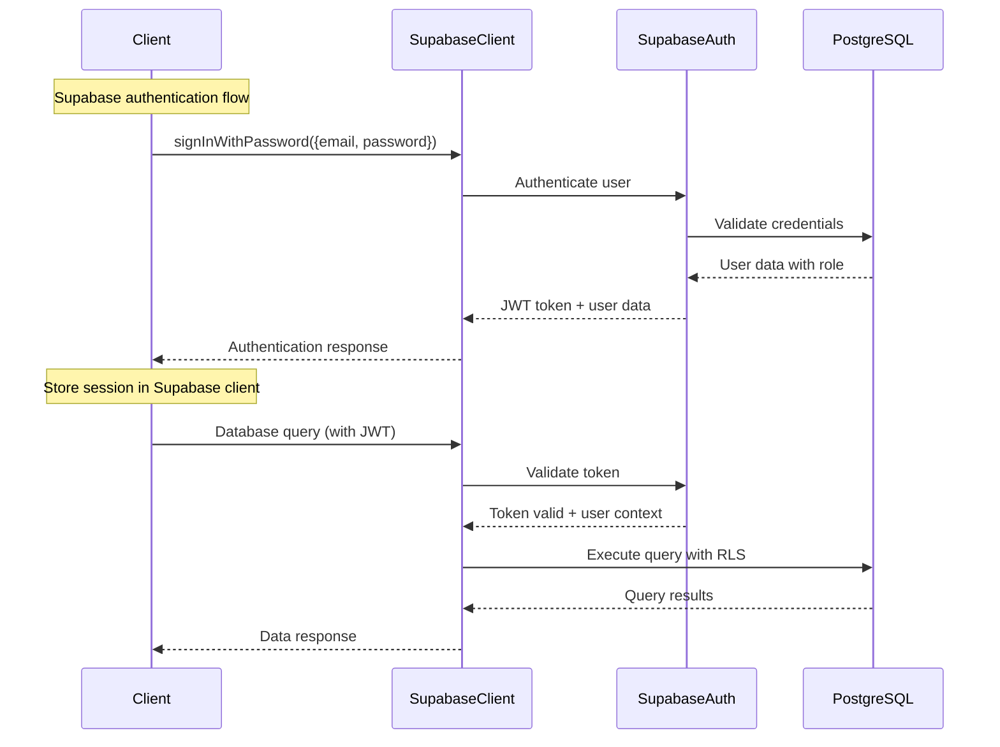
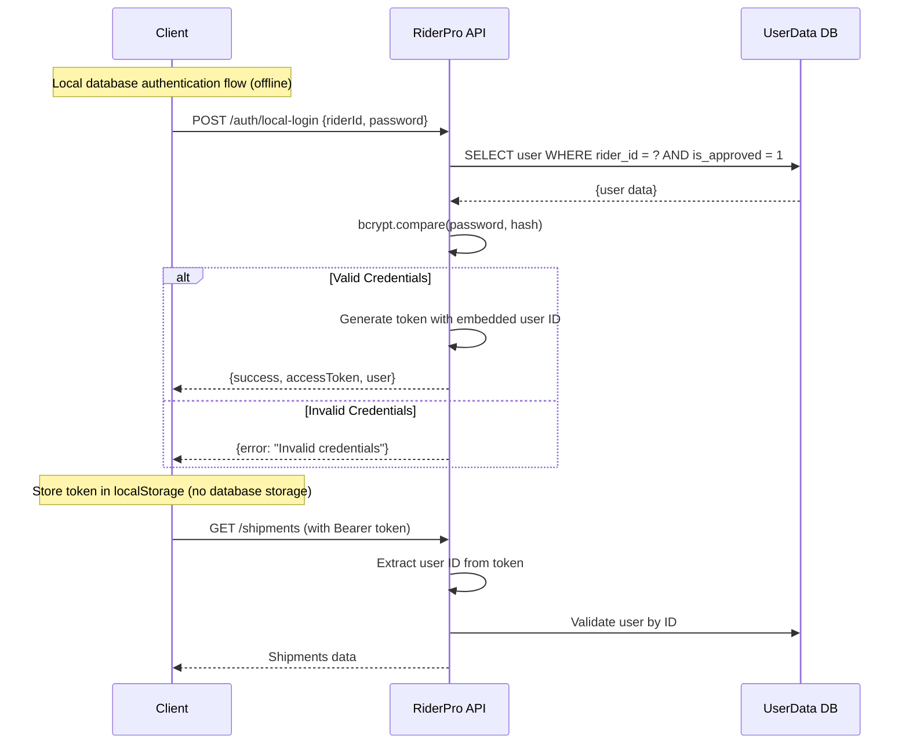

# Authentication System

## Overview

RiderPro implements a comprehensive authentication system with Supabase Auth as the primary authentication provider, complemented by local database authentication for offline scenarios. The system provides role-based access control, secure token management, and seamless integration with Supabase's built-in security features.

## Architecture

### Supabase Authentication System

#### Primary Authentication
- **Supabase Auth**: Primary authentication provider with JWT tokens
- **Email/Password**: Standard email and password authentication
- **Social Auth**: Optional integration with Google, GitHub, etc.
- **Email Verification**: Built-in email verification system
- **Password Reset**: Secure password reset via email
- **Session Management**: Automatic token refresh and session handling

#### Local Database Fallback
- **Offline Support**: Local SQLite database for offline authentication
- **Registration**: Users register with `rider_id`, `password`, `full_name`, `email`
- **Approval Workflow**: Admin approval required before login
- **Password Security**: bcrypt hashing with 12 salt rounds
- **Token Generation**: Simple token-based authentication with embedded user ID
- **Role Assignment**: Role-based permissions using existing `role` column
- **Storage**: User data stored in `userdata.db`, tokens stored in localStorage only

### Authentication Flow

#### Supabase Authentication Flow


#### Local Database Authentication Flow


## Supabase Auth Integration

### Supabase Client Setup

```typescript
import { createClient } from '@supabase/supabase-js'

const supabaseUrl = process.env.VITE_SUPABASE_URL
const supabaseKey = process.env.VITE_SUPABASE_ANON_KEY

export const supabase = createClient(supabaseUrl, supabaseKey, {
  auth: {
    autoRefreshToken: true,
    persistSession: true,
    detectSessionInUrl: true
  }
})
```

### Authentication Methods

#### Email/Password Authentication
```typescript
// Sign up
const { data, error } = await supabase.auth.signUp({
  email: 'user@example.com',
  password: 'password123',
  options: {
    data: {
      full_name: 'John Doe',
      rider_id: 'RIDER001',
      role: 'driver'
    }
  }
})

// Sign in
const { data, error } = await supabase.auth.signInWithPassword({
  email: 'user@example.com',
  password: 'password123'
})

// Sign out
const { error } = await supabase.auth.signOut()
```

#### Session Management
```typescript
// Get current user
const { data: { user }, error } = await supabase.auth.getUser()

// Listen to auth changes
supabase.auth.onAuthStateChange((event, session) => {
  if (event === 'SIGNED_IN') {
    console.log('User signed in:', session.user)
  } else if (event === 'SIGNED_OUT') {
    console.log('User signed out')
  }
})
```

### Row Level Security (RLS)

Supabase provides built-in security through Row Level Security policies:

```sql
-- Enable RLS on shipments table
ALTER TABLE shipments ENABLE ROW LEVEL SECURITY;

-- Users can only view their own shipments
CREATE POLICY "Users can view own shipments" ON shipments
  FOR SELECT USING (auth.uid()::text = "employeeId");

-- Managers can view all shipments
CREATE POLICY "Managers can view all shipments" ON shipments
  FOR SELECT USING (
    EXISTS (
      SELECT 1 FROM user_profiles 
      WHERE user_profiles.id = auth.uid() 
      AND user_profiles.role IN ('super_user', 'ops_team', 'staff')
    )
  );
```

## User Roles and Permissions

### Role-Based Permission System

The system uses a comprehensive role-based approach with Supabase Auth and local database fallback:

#### 1. **Super User** (`role: 'super_user'` or `role: 'admin'`)
- **Database**: `role` column set to `'super_user'` or `'admin'`
- **Permissions**:
  - Full system access
  - Admin page access
  - User management (approve/reject/reset passwords)
  - System configuration
  - All shipment and route operations
  - Analytics and reporting
  - Health check settings
  - Access to all users endpoint

#### 2. **Ops Team** (`role: 'ops_team'`)
- **Database**: `role` column set to `'ops_team'`
- **Permissions**:
  - Edit access to shipments
  - View all shipments
  - Manage all routes
  - Access analytics and reports
  - Export data
  - View live tracking
  - Batch operations
  - Upload acknowledgments

#### 3. **Staff** (`role: 'staff'`)
- **Database**: `role` column set to `'staff'`
- **Permissions**:
  - View all shipments
  - Basic route management
  - Access analytics and reports
  - Upload acknowledgments

#### 4. **Driver** (`role: 'driver'` or default)
- **Database**: `role` column set to `'driver'` or default
- **Permissions**:
  - View own shipments only
  - Update shipment status
  - Record GPS tracking data
  - Access basic dashboard
  - Upload acknowledgments

### PIA API Role Mapping

The system receives roles from PIA API and preserves them for server-side filtering:

| PIA Response | Internal Mapping | UI Role | Shipment Access | Admin Access | Edit Access |
|-------------|------------------|---------|-----------------|--------------|-------------|
| `is_super_user: true` | `is_super_user: true` | `ADMIN` | All shipments | ✅ | ✅ |
| `is_ops_team: true` | `is_ops_team: true` | `MANAGER` | All shipments | ❌ | ✅ |
| `is_staff: true` | `is_staff: true` | `MANAGER` | All shipments | ❌ | ✅ |
| Any other combination | Default (no flags) | `DRIVER` | Own shipments only | ❌ | ❌ (own data only) |

### Permission Matrix

| Feature | Driver | Rider | Super User |
|---------|--------|-------|------------|
| View Own Shipments | ✅ | ✅ | ✅ |
| View All Shipments | ❌ | ✅ | ✅ |
| Create Shipments | ❌ | ✅ | ✅ |
| Update Shipments | ✅ (own) | ✅ | ✅ |
| Delete Shipments | ❌ | ✅ | ✅ |
| GPS Tracking | ✅ | ❌ | ❌ |
| Route Management | ✅ (own) | ✅ | ✅ |
| Analytics | Basic | Full | Full |
| User Management | ❌ | ❌ | ✅ |
| System Settings | ❌ | ❌ | ✅ |
| Admin Page Access | ❌ | ❌ | ✅ |
| Batch Operations | ❌ | ✅ | ✅ |
| Data Export | ❌ | ✅ | ✅ |
| Upload Acknowledgments | ✅ | ✅ | ✅ |

### UI Role Mapping

The system maintains the original UserRole enum for UI purposes:

| Internal Role | UI Role | Description |
|---------------|---------|-------------|
| `is_super_user: true` | `ADMIN` | Full administrative access with admin page |
| `is_rider: true` | `MANAGER` | Management-level access with edit permissions |
| Default (no flags) | `DRIVER` | Basic driver access |

## Security Implementation

### Supabase Security Features

#### Built-in Security
- **JWT Tokens**: Secure JWT tokens with automatic refresh
- **Password Hashing**: Automatic bcrypt hashing with salt
- **Rate Limiting**: Built-in rate limiting for authentication attempts
- **Email Verification**: Automatic email verification for new accounts
- **Password Reset**: Secure password reset via email
- **Session Management**: Automatic session timeout and refresh

#### Row Level Security (RLS)
```sql
-- Enable RLS on all tables
ALTER TABLE shipments ENABLE ROW LEVEL SECURITY;
ALTER TABLE route_sessions ENABLE ROW LEVEL SECURITY;
ALTER TABLE route_tracking ENABLE ROW LEVEL SECURITY;

-- Example RLS policies
CREATE POLICY "Users can view own data" ON shipments
  FOR SELECT USING (auth.uid()::text = "employeeId");

CREATE POLICY "Managers can view all data" ON shipments
  FOR SELECT USING (
    EXISTS (
      SELECT 1 FROM user_profiles 
      WHERE user_profiles.id = auth.uid() 
      AND user_profiles.role IN ('super_user', 'ops_team', 'staff')
    )
  );
```

### Local Database Security

#### bcrypt Hashing
```typescript
// Password hashing during registration
const saltRounds = 12;
const passwordHash = await bcrypt.hash(password, saltRounds);

// Password verification during login
const isValidPassword = await bcrypt.compare(password, user.password_hash);
```

#### Password Requirements
- Minimum 8 characters
- No specific complexity requirements (can be enhanced)
- Stored as bcrypt hash in database
- Never stored in plain text

### Token Management

#### Simplified Token System
- **Access Token**: `local_<timestamp>_<userId>` (embedded user ID)
- **Refresh Token**: `refresh_<timestamp>_<random>` (for future use)
- **Storage**: localStorage only (no database storage)
- **Usage**: Bearer token in Authorization header
- **Validation**: Extract user ID from token and validate against database

### Data Storage

#### localStorage Structure
```javascript
{
  access_token: "token_value",
  refresh_token: "refresh_value", 
  full_name: "User Full Name",
  employee_id: "EMP123",
  is_staff: "true/false",
  is_super_user: "true/false",
  is_ops_team: "true/false"
}
```

#### Security Considerations
- **No Sensitive Data**: Only necessary user info stored
- **Token Expiration**: Tokens expire automatically
- **Clear on Logout**: All auth data cleared on logout
- **No Session Storage**: localStorage only for simplicity

## User Management

### Registration Process

#### Local User Registration
1. **User Registration**: `POST /api/auth/register`
   ```json
   {
     "riderId": "RIDER001",
     "password": "securepassword",
     "fullName": "John Doe",
     "email": "john@example.com"
   }
   ```

2. **Password Hashing**: bcrypt with 12 salt rounds
3. **Database Storage**: User stored with `is_approved: false`
4. **Admin Notification**: User appears in pending approvals

#### Admin Approval Process
1. **View Pending Users**: `GET /api/auth/pending-approvals`
2. **Approve User**: `POST /api/auth/approve/:userId`
3. **Reject User**: `POST /api/auth/reject/:userId`
4. **User Can Login**: Only after approval

### Password Management

#### Password Reset
- **Admin Initiated**: `POST /api/auth/reset-password/:userId`
- **New Password**: Admin sets new password
- **bcrypt Hashing**: New password hashed with 12 salt rounds
- **User Notification**: User notified of password change

#### Password Security
- **Hashing**: bcrypt with 12 salt rounds
- **Storage**: Only hashed passwords stored
- **Verification**: bcrypt.compare() for validation
- **Reset**: Admin can reset any user's password

## API Integration

### External API Integration

#### Printo API Authentication
```typescript
// External API call
const response = await fetch('https://pia.printo.in/api/v1/auth/', {
  method: 'POST',
  headers: { 'Content-Type': 'application/json' },
  body: JSON.stringify({ employee_id, password })
});

const data = await response.json();
// Response: { access, refresh, full_name, is_staff, is_super_user, is_ops_team }
```

#### Role Determination
```typescript
private determineRole(isStaff?: boolean, isSuperUser?: boolean, isOpsTeam?: boolean): UserRole {
  if (isSuperUser === true) return UserRole.ADMIN;
  if (isOpsTeam === true) return UserRole.MANAGER;
  if (isStaff === true) return UserRole.VIEWER;
  return UserRole.DRIVER; // Default role
}
```

### Local Database Integration

#### User Registration
```sql
INSERT INTO rider_accounts (
  rider_id, password_hash, full_name, email, 
  is_active, is_approved, created_at, updated_at
) VALUES (?, ?, ?, ?, 1, 0, datetime('now'), datetime('now'))
```

#### User Login
```sql
SELECT id, rider_id, full_name, email, password_hash, is_active, is_approved
FROM rider_accounts 
WHERE rider_id = ? AND is_active = 1
```

## Error Handling

### Authentication Errors

#### External API Errors
- **401 Unauthorized**: Invalid credentials
- **403 Forbidden**: Account disabled or locked
- **500 Server Error**: External API unavailable
- **Network Error**: Connection issues

#### Local Database Errors
- **400 Bad Request**: Missing required fields
- **401 Unauthorized**: Invalid credentials
- **403 Forbidden**: Account not approved
- **500 Server Error**: Database or server error

### Error Response Format
```json
{
  "success": false,
  "message": "Error description",
  "code": "ERROR_CODE",
  "details": {}
}
```

## Security Best Practices

### Client-Side Security
- **Input Validation**: Validate all user inputs
- **XSS Prevention**: Sanitize user inputs
- **CSRF Protection**: Use secure tokens
- **Secure Storage**: Use localStorage appropriately

### Server-Side Security
- **Input Validation**: Validate all API inputs
- **SQL Injection Prevention**: Use parameterized queries
- **Rate Limiting**: Prevent brute force attacks
- **CORS Configuration**: Secure cross-origin requests

### Database Security
- **Password Hashing**: bcrypt with appropriate salt rounds
- **Data Encryption**: Encrypt sensitive data at rest
- **Access Control**: Limit database access
- **Audit Logging**: Log all authentication attempts

## Monitoring and Logging

### Authentication Logging
- **Login Attempts**: Success and failure logging
- **Password Resets**: Admin-initiated password changes
- **User Approvals**: Admin approval/rejection actions
- **Token Usage**: API request logging with tokens

### Security Monitoring
- **Failed Login Attempts**: Track suspicious activity
- **Password Reset Patterns**: Monitor unusual reset requests
- **Role Changes**: Log permission modifications
- **System Access**: Track admin actions

## Troubleshooting

### Common Issues

#### Authentication Failures
1. **Invalid Credentials**: Check username/password
2. **Account Not Approved**: Contact administrator
3. **Token Expired**: Refresh or re-login
4. **Network Issues**: Check connectivity

#### Role Permission Issues
1. **Insufficient Permissions**: Check user role
2. **Role Not Assigned**: Contact administrator
3. **Permission Denied**: Verify role hierarchy
4. **Access Restricted**: Check feature flags

#### Database Issues
1. **User Not Found**: Check registration status
2. **Password Mismatch**: Verify password hash
3. **Account Disabled**: Check is_active status
4. **Approval Pending**: Wait for admin approval

### Debug Information
```typescript
// Check authentication status
console.log('Auth State:', authService.getAuthenticationStatus());

// Check localStorage
console.log('LocalStorage:', {
  accessToken: localStorage.getItem('access_token'),
  refreshToken: localStorage.getItem('refresh_token'),
  fullName: localStorage.getItem('full_name'),
  employeeId: localStorage.getItem('employee_id')
});

// Check user role
console.log('User Role:', user?.role);
console.log('Permissions:', {
  isSuperUser: user?.isSuperUser,
  isOpsTeam: user?.isOpsTeam,
  isStaff: user?.isStaff
});
```

---

**Last Updated**: December 2024  
**Version**: 2.0.0  
**Security Level**: Production-ready with bcrypt and comprehensive validation