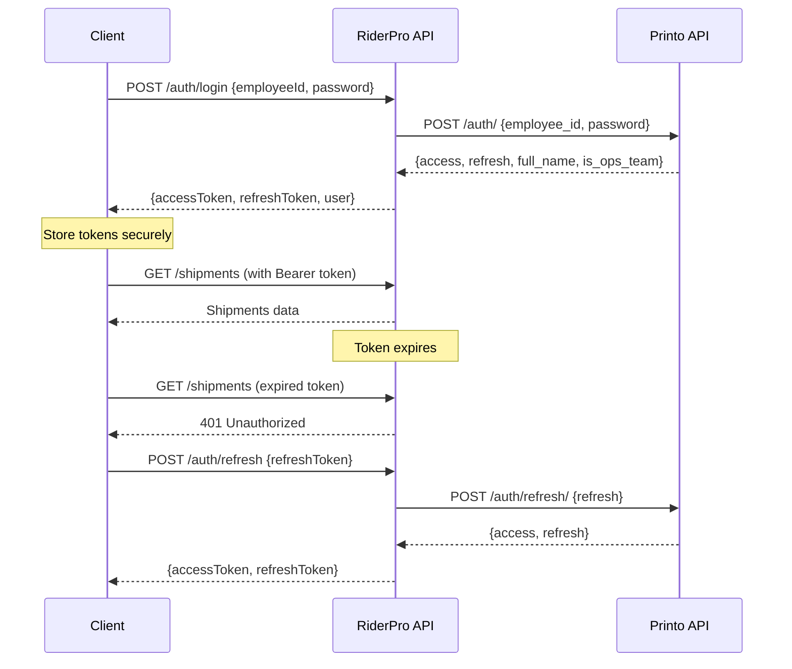

# Authentication System

## Overview

RiderPro implements a secure, modern authentication system that integrates with external Printo API for user verification while maintaining local session management and role-based access control.

## Architecture

### External Integration
- **Primary Auth**: Printo API (`https://pia.printo.in/api/v1/auth/`)
- **Token Management**: JWT access and refresh tokens
- **Role Assignment**: Based on `is_ops_team` flag from Printo API
- **Local Storage**: Secure token storage with automatic refresh

### Authentication Flow



## User Roles and Permissions

### Role Hierarchy
1. **Driver** (`role: "driver"`)
   - View own shipments only
   - Update shipment status
   - Record GPS tracking data
   - Access basic dashboard

2. **Operations Team** (`role: "ops_team"`)
   - View all shipments
   - Manage all routes
   - Access analytics and reports
   - Export data
   - View live tracking

### Permission Matrix

| Feature | Driver | Ops Team |
|---------|--------|----------|
| View Own Shipments | ✅ | ✅ |
| View All Shipments | ❌ | ✅ |
| Update Shipment Status | ✅ | ✅ |
| Batch Update Shipments | ❌ | ✅ |
| GPS Tracking | ✅ | ✅ |
| Route Analytics | ❌ | ✅ |
| Export Data | ❌ | ✅ |
| Live Tracking Dashboard | ❌ | ✅ |
| Admin Panel | ❌ | ❌ |

### Role Assignment Logic

```typescript
// Role assignment based on Printo API response
const assignRole = (printoResponse: PrintoAuthResponse): UserRole => {
  if (printoResponse.is_ops_team) {
    return UserRole.OPS_TEAM;
  }
  return UserRole.DRIVER;
};

// User object creation
const user: User = {
  id: employeeId,
  username: employeeId,
  employeeId: employeeId,
  email: employeeId,
  fullName: printoResponse.full_name || employeeId,
  role: assignRole(printoResponse),
  isActive: true,
  permissions: [],
  isOpsTeam: printoResponse.is_ops_team || false,
  isAdmin: printoResponse.is_ops_team || false,
  isSuperAdmin: false // No hardcoded super admin accounts
};
```

## Token Management

### JWT Token Structure

**Access Token Payload:**
```json
{
  "sub": "employee_id",
  "name": "Full Name",
  "role": "ops_team|driver",
  "is_ops_team": boolean,
  "iat": 1642248000,
  "exp": 1642251600
}
```

**Refresh Token:**
- Longer expiration (7 days)
- Used only for token refresh
- Automatically rotated on refresh

### Automatic Token Refresh

```typescript
class AuthService {
  private async refreshTokenIfNeeded(): Promise<void> {
    const token = this.getAccessToken();
    if (!token || this.isTokenExpired(token)) {
      await this.refreshToken();
    }
  }

  private async refreshToken(): Promise<void> {
    const refreshToken = this.getRefreshToken();
    if (!refreshToken) {
      throw new Error('No refresh token available');
    }

    const response = await fetch('https://pia.printo.in/api/v1/auth/refresh/', {
      method: 'POST',
      headers: { 'Content-Type': 'application/json' },
      body: JSON.stringify({ refresh: refreshToken })
    });

    if (!response.ok) {
      this.logout();
      throw new Error('Token refresh failed');
    }

    const data = await response.json();
    this.storeTokens(data.access, data.refresh);
  }
}
```

## Security Features

### Token Storage
- **LocalStorage**: Encrypted token storage
- **Memory Cache**: Runtime token caching
- **Automatic Cleanup**: Tokens cleared on logout
- **Expiration Handling**: Automatic refresh before expiration

### Request Security
```typescript
// Automatic authentication headers
class ApiClient {
  private async request(url: string, options: RequestInit = {}): Promise<Response> {
    await this.authService.refreshTokenIfNeeded();
    
    const token = this.authService.getAccessToken();
    const headers = {
      'Content-Type': 'application/json',
      'Authorization': `Bearer ${token}`,
      ...options.headers
    };

    return fetch(url, { ...options, headers });
  }
}
```

### Session Management
- **Automatic Logout**: On token refresh failure
- **Concurrent Sessions**: Multiple tabs supported
- **Storage Events**: Cross-tab logout synchronization
- **Idle Timeout**: Configurable session timeout

## Client-Side Implementation

### React Hook Usage

```typescript
import { useAuth } from '@/hooks/useAuth';

function MyComponent() {
  const { 
    user, 
    isAuthenticated, 
    isLoading, 
    login, 
    logout,
    isAdmin,
    isOpsTeam 
  } = useAuth();

  if (isLoading) return <LoadingSpinner />;
  if (!isAuthenticated) return <LoginForm />;

  return (
    <div>
      <h1>Welcome, {user.fullName}</h1>
      {isOpsTeam && <AdminPanel />}
    </div>
  );
}
```

### Protected Routes

```typescript
import { useAuth } from '@/hooks/useAuth';
import { Navigate } from 'wouter';

function ProtectedRoute({ children, requireOpsTeam = false }) {
  const { isAuthenticated, isOpsTeam, isLoading } = useAuth();

  if (isLoading) return <LoadingSpinner />;
  if (!isAuthenticated) return <Navigate to="/login" />;
  if (requireOpsTeam && !isOpsTeam) return <Navigate to="/unauthorized" />;

  return children;
}
```

### API Client Integration

```typescript
import { apiClient } from '@/services/ApiClient';

// Automatic authentication - no manual token handling needed
const shipments = await apiClient.get('/api/shipments');
const dashboard = await apiClient.get('/api/dashboard/metrics');
```

## Error Handling

### Authentication Errors

```typescript
// Common authentication error scenarios
enum AuthError {
  INVALID_CREDENTIALS = 'Invalid employee ID or password',
  TOKEN_EXPIRED = 'Session expired, please log in again',
  REFRESH_FAILED = 'Unable to refresh session',
  NETWORK_ERROR = 'Network connection failed',
  EXTERNAL_API_ERROR = 'Authentication service unavailable'
}
```

### Error Recovery

```typescript
class AuthService {
  private async handleAuthError(error: AuthError): Promise<void> {
    switch (error) {
      case AuthError.TOKEN_EXPIRED:
      case AuthError.REFRESH_FAILED:
        await this.logout();
        this.redirectToLogin();
        break;
      
      case AuthError.NETWORK_ERROR:
        // Retry with exponential backoff
        await this.retryWithBackoff();
        break;
      
      case AuthError.EXTERNAL_API_ERROR:
        // Show offline mode or retry later
        this.showOfflineMessage();
        break;
    }
  }
}
```

## Configuration

### Environment Variables

```bash
# Authentication endpoints
VITE_AUTH_BASE_URL=https://pia.printo.in/api/v1
VITE_API_BASE_URL=http://localhost:5000/api

# Token configuration
JWT_ACCESS_TOKEN_EXPIRY=1h
JWT_REFRESH_TOKEN_EXPIRY=7d

# Security settings
CORS_ORIGINS=http://localhost:5000,https://your-domain.com
RATE_LIMIT_AUTH=5
RATE_LIMIT_API=100
```

### Client Configuration

```typescript
// AuthContext configuration
const authConfig = {
  tokenRefreshThreshold: 5 * 60 * 1000, // 5 minutes before expiry
  maxRetryAttempts: 3,
  retryDelay: 1000,
  sessionTimeout: 8 * 60 * 60 * 1000, // 8 hours
  enableCrossTabSync: true
};
```

## Testing

### Unit Tests

```typescript
describe('AuthService', () => {
  it('should login with valid credentials', async () => {
    const result = await authService.login('EMP001', 'password');
    expect(result.success).toBe(true);
    expect(result.user.employeeId).toBe('EMP001');
  });

  it('should refresh token automatically', async () => {
    // Mock expired token
    jest.spyOn(authService, 'isTokenExpired').mockReturnValue(true);
    
    await authService.refreshTokenIfNeeded();
    
    expect(authService.getAccessToken()).toBeTruthy();
  });

  it('should logout on refresh failure', async () => {
    // Mock refresh failure
    mockFetch.mockRejectedValueOnce(new Error('Refresh failed'));
    
    await expect(authService.refreshToken()).rejects.toThrow();
    expect(authService.isAuthenticated()).toBe(false);
  });
});
```

### Integration Tests

```typescript
describe('Authentication Flow', () => {
  it('should complete full login flow', async () => {
    // Test login -> API call -> token refresh -> logout
    await authService.login('EMP001', 'password');
    
    const shipments = await apiClient.get('/api/shipments');
    expect(shipments).toBeDefined();
    
    // Simulate token expiry and refresh
    await authService.refreshToken();
    
    const newShipments = await apiClient.get('/api/shipments');
    expect(newShipments).toBeDefined();
    
    await authService.logout();
    expect(authService.isAuthenticated()).toBe(false);
  });
});
```

## Security Best Practices

1. **No Hardcoded Credentials**: All authentication goes through Printo API
2. **Token Rotation**: Refresh tokens are rotated on each refresh
3. **Secure Storage**: Tokens stored securely with encryption
4. **HTTPS Only**: All authentication requests use HTTPS
5. **Rate Limiting**: Prevent brute force attacks
6. **Input Validation**: All inputs validated and sanitized
7. **Error Handling**: No sensitive information in error messages
8. **Session Management**: Proper session cleanup and timeout handling

## Troubleshooting

### Common Issues

1. **Login Fails**: Check Printo API connectivity and credentials
2. **Token Refresh Fails**: Verify refresh token validity and network connection
3. **Permission Denied**: Check user role and permissions
4. **Cross-Tab Issues**: Ensure storage event listeners are working
5. **Network Errors**: Implement proper retry logic and offline handling

### Debug Mode

```typescript
// Enable debug logging
localStorage.setItem('auth_debug', 'true');

// Check authentication state
console.log('Auth State:', {
  isAuthenticated: authService.isAuthenticated(),
  user: authService.getCurrentUser(),
  tokenExpiry: authService.getTokenExpiry()
});
```