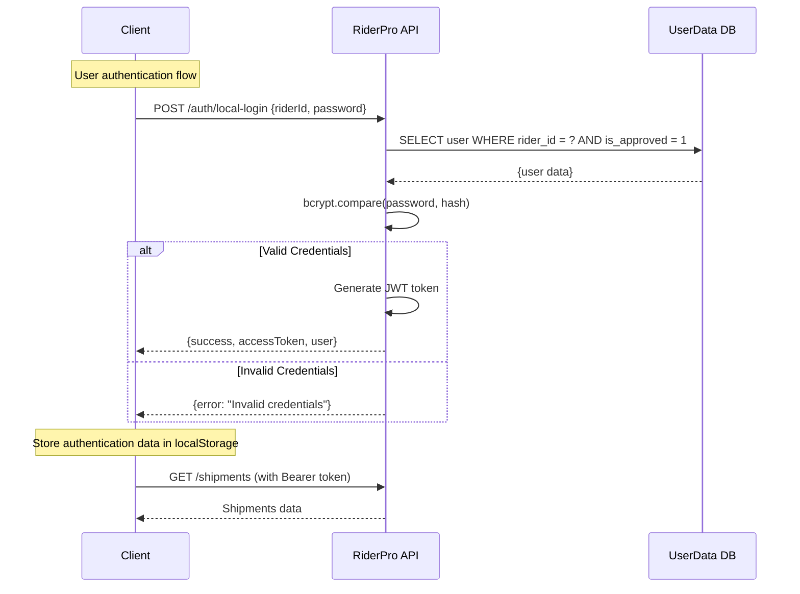

# Authentication System

## Overview

RiderPro implements a secure local authentication system with role-based access control. The system has been simplified to use local database authentication with bcrypt password hashing and comprehensive user management features.

## Architecture

### Local Authentication System

#### Database Authentication
- **Primary Auth**: Local SQLite database (`userdata.db`)
- **Registration**: Users register with `rider_id`, `password`, `full_name`, `email`
- **Approval Workflow**: Admin approval required before login
- **Password Security**: bcrypt hashing with 12 salt rounds
- **Token Generation**: JWT-based authentication
- **Role Assignment**: Configurable roles (Super User, Ops Team, Staff, Driver)
- **Storage**: User data stored in `userdata.db` with localStorage for session management

### Authentication Flow



## User Roles and Permissions

### Role Hierarchy

#### 1. **Admin** (`role: "admin"`)
- **Source**: `is_super_user: true` from external API
- **Permissions**:
  - Full system access
  - User management (approve/reject/reset passwords)
  - System configuration
  - All shipment and route operations
  - Analytics and reporting
  - Health check settings

#### 2. **Manager** (`role: "manager"`)
- **Source**: `is_ops_team: true` from external API
- **Permissions**:
  - View all shipments
  - Manage all routes
  - Access analytics and reports
  - Export data
  - View live tracking
  - Batch operations

#### 3. **Viewer** (`role: "viewer"`)
- **Source**: `is_staff: true` from external API
- **Permissions**:
  - View shipments (read-only)
  - Access basic dashboard
  - View analytics (limited)
  - No modification rights

#### 4. **Driver** (`role: "driver"`)
- **Source**: Default role for local users or when no flags present
- **Permissions**:
  - View own shipments only
  - Update shipment status
  - Record GPS tracking data
  - Access basic dashboard
  - Upload acknowledgments

### Permission Matrix

| Feature | Driver | Viewer | Manager | Admin |
|---------|--------|--------|---------|-------|
| View Own Shipments | ✅ | ✅ | ✅ | ✅ |
| View All Shipments | ❌ | ✅ | ✅ | ✅ |
| Create Shipments | ❌ | ❌ | ✅ | ✅ |
| Update Shipments | ✅ (own) | ❌ | ✅ | ✅ |
| Delete Shipments | ❌ | ❌ | ❌ | ✅ |
| GPS Tracking | ✅ | ❌ | ✅ | ✅ |
| Route Management | ✅ (own) | ❌ | ✅ | ✅ |
| Analytics | Basic | Limited | Full | Full |
| User Management | ❌ | ❌ | ❌ | ✅ |
| System Settings | ❌ | ❌ | ❌ | ✅ |
| Batch Operations | ❌ | ❌ | ✅ | ✅ |
| Data Export | ❌ | ❌ | ✅ | ✅ |

## Security Implementation

### Password Security

#### bcrypt Hashing
```typescript
// Password hashing during registration
const saltRounds = 12;
const passwordHash = await bcrypt.hash(password, saltRounds);

// Password verification during login
const isValidPassword = await bcrypt.compare(password, user.password_hash);
```

#### Password Requirements
- Minimum 8 characters
- No specific complexity requirements (can be enhanced)
- Stored as bcrypt hash in database
- Never stored in plain text

### Token Management

#### External API Tokens
- **Access Token**: Short-lived token for API requests
- **Refresh Token**: Long-lived token for token renewal
- **Storage**: localStorage for persistence
- **Usage**: Bearer token in Authorization header

#### Local Database Tokens
- **Format**: `local_<timestamp>_<random>`
- **Refresh Format**: `refresh_<timestamp>_<random>`
- **Storage**: localStorage for persistence
- **Usage**: Simple token-based authentication

### Data Storage

#### localStorage Structure
```javascript
{
  access_token: "token_value",
  refresh_token: "refresh_value", 
  full_name: "User Full Name",
  employee_id: "EMP123",
  is_staff: "true/false",
  is_super_user: "true/false",
  is_ops_team: "true/false"
}
```

#### Security Considerations
- **No Sensitive Data**: Only necessary user info stored
- **Token Expiration**: Tokens expire automatically
- **Clear on Logout**: All auth data cleared on logout
- **No Session Storage**: localStorage only for simplicity

## User Management

### Registration Process

#### Local User Registration
1. **User Registration**: `POST /api/auth/register`
   ```json
   {
     "riderId": "RIDER001",
     "password": "securepassword",
     "fullName": "John Doe",
     "email": "john@example.com"
   }
   ```

2. **Password Hashing**: bcrypt with 12 salt rounds
3. **Database Storage**: User stored with `is_approved: false`
4. **Admin Notification**: User appears in pending approvals

#### Admin Approval Process
1. **View Pending Users**: `GET /api/auth/pending-approvals`
2. **Approve User**: `POST /api/auth/approve/:userId`
3. **Reject User**: `POST /api/auth/reject/:userId`
4. **User Can Login**: Only after approval

### Password Management

#### Password Reset
- **Admin Initiated**: `POST /api/auth/reset-password/:userId`
- **New Password**: Admin sets new password
- **bcrypt Hashing**: New password hashed with 12 salt rounds
- **User Notification**: User notified of password change

#### Password Security
- **Hashing**: bcrypt with 12 salt rounds
- **Storage**: Only hashed passwords stored
- **Verification**: bcrypt.compare() for validation
- **Reset**: Admin can reset any user's password

## API Integration

### External API Integration

#### Printo API Authentication
```typescript
// External API call
const response = await fetch('https://pia.printo.in/api/v1/auth/', {
  method: 'POST',
  headers: { 'Content-Type': 'application/json' },
  body: JSON.stringify({ employee_id, password })
});

const data = await response.json();
// Response: { access, refresh, full_name, is_staff, is_super_user, is_ops_team }
```

#### Role Determination
```typescript
private determineRole(isStaff?: boolean, isSuperUser?: boolean, isOpsTeam?: boolean): UserRole {
  if (isSuperUser === true) return UserRole.ADMIN;
  if (isOpsTeam === true) return UserRole.MANAGER;
  if (isStaff === true) return UserRole.VIEWER;
  return UserRole.DRIVER; // Default role
}
```

### Local Database Integration

#### User Registration
```sql
INSERT INTO rider_accounts (
  rider_id, password_hash, full_name, email, 
  is_active, is_approved, created_at, updated_at
) VALUES (?, ?, ?, ?, 1, 0, datetime('now'), datetime('now'))
```

#### User Login
```sql
SELECT id, rider_id, full_name, email, password_hash, is_active, is_approved
FROM rider_accounts 
WHERE rider_id = ? AND is_active = 1
```

## Error Handling

### Authentication Errors

#### External API Errors
- **401 Unauthorized**: Invalid credentials
- **403 Forbidden**: Account disabled or locked
- **500 Server Error**: External API unavailable
- **Network Error**: Connection issues

#### Local Database Errors
- **400 Bad Request**: Missing required fields
- **401 Unauthorized**: Invalid credentials
- **403 Forbidden**: Account not approved
- **500 Server Error**: Database or server error

### Error Response Format
```json
{
  "success": false,
  "message": "Error description",
  "code": "ERROR_CODE",
  "details": {}
}
```

## Security Best Practices

### Client-Side Security
- **Input Validation**: Validate all user inputs
- **XSS Prevention**: Sanitize user inputs
- **CSRF Protection**: Use secure tokens
- **Secure Storage**: Use localStorage appropriately

### Server-Side Security
- **Input Validation**: Validate all API inputs
- **SQL Injection Prevention**: Use parameterized queries
- **Rate Limiting**: Prevent brute force attacks
- **CORS Configuration**: Secure cross-origin requests

### Database Security
- **Password Hashing**: bcrypt with appropriate salt rounds
- **Data Encryption**: Encrypt sensitive data at rest
- **Access Control**: Limit database access
- **Audit Logging**: Log all authentication attempts

## Monitoring and Logging

### Authentication Logging
- **Login Attempts**: Success and failure logging
- **Password Resets**: Admin-initiated password changes
- **User Approvals**: Admin approval/rejection actions
- **Token Usage**: API request logging with tokens

### Security Monitoring
- **Failed Login Attempts**: Track suspicious activity
- **Password Reset Patterns**: Monitor unusual reset requests
- **Role Changes**: Log permission modifications
- **System Access**: Track admin actions

## Troubleshooting

### Common Issues

#### Authentication Failures
1. **Invalid Credentials**: Check username/password
2. **Account Not Approved**: Contact administrator
3. **Token Expired**: Refresh or re-login
4. **Network Issues**: Check connectivity

#### Role Permission Issues
1. **Insufficient Permissions**: Check user role
2. **Role Not Assigned**: Contact administrator
3. **Permission Denied**: Verify role hierarchy
4. **Access Restricted**: Check feature flags

#### Database Issues
1. **User Not Found**: Check registration status
2. **Password Mismatch**: Verify password hash
3. **Account Disabled**: Check is_active status
4. **Approval Pending**: Wait for admin approval

### Debug Information
```typescript
// Check authentication status
console.log('Auth State:', authService.getAuthenticationStatus());

// Check localStorage
console.log('LocalStorage:', {
  accessToken: localStorage.getItem('access_token'),
  refreshToken: localStorage.getItem('refresh_token'),
  fullName: localStorage.getItem('full_name'),
  employeeId: localStorage.getItem('employee_id')
});

// Check user role
console.log('User Role:', user?.role);
console.log('Permissions:', {
  isSuperUser: user?.isSuperUser,
  isOpsTeam: user?.isOpsTeam,
  isStaff: user?.isStaff
});
```

---

**Last Updated**: December 2024  
**Version**: 2.0.0  
**Security Level**: Production-ready with bcrypt and comprehensive validation