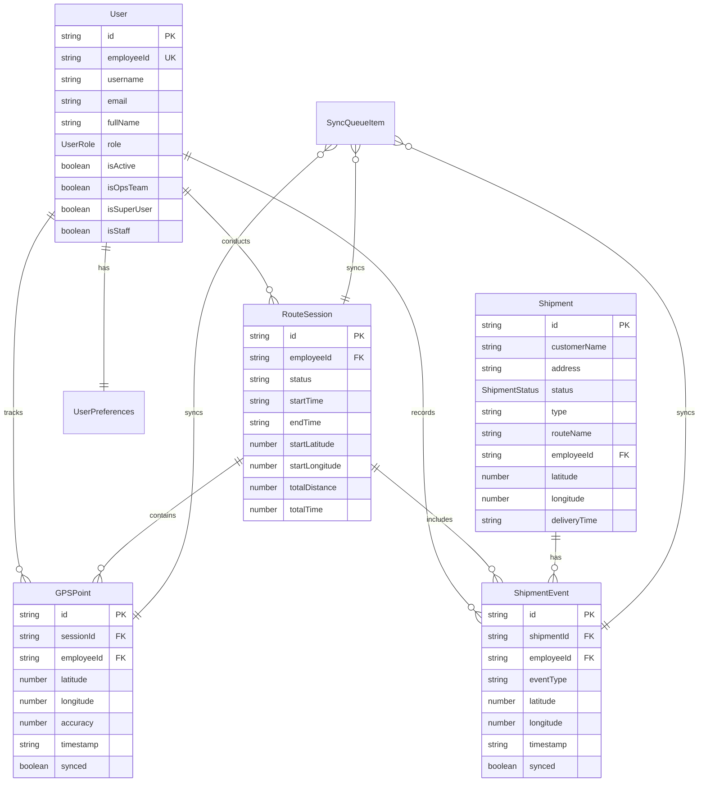

# Database Schema Documentation

## Overview

RiderPro uses a multi-database architecture with SQLite databases for server-side persistence and IndexedDB for client-side offline functionality. The system has been redesigned to use three distinct SQLite databases for optimal performance and data management.

## Database Architecture

### Server-Side Storage (SQLite)

The server uses three separate SQLite databases for different purposes:

#### 1. Main Database (`main.db`)
- **Purpose**: Primary operational database for daily operations
- **Cleanup**: Daily cleanup script removes old data
- **Tables**: All operational tables (shipments, routes, tracking, etc.)

#### 2. Replica Database (`replica.db`)
- **Purpose**: Backup and data retention
- **Retention**: Maintains data for minimum 3 days
- **Tables**: Mirrored structure of main database

#### 3. User Data Database (`userdata.db`)
- **Purpose**: User profiles and local authentication
- **Tables**: rider_accounts, user_preferences
- **Security**: Isolated from operational data

### Client-Side Storage (IndexedDB)

The client uses IndexedDB for offline-first functionality, storing GPS data, route sessions, and sync queues locally.

#### Database: `RouteTrackingOffline`
**Version**: 1
**Stores**: `gpsRecords`, `routeSessions`

## SQLite Database Schema

### Main Database Tables (main.db)

#### Shipments Table (Consolidated)
The shipments table has been consolidated to include acknowledgment and sync status fields directly, eliminating the need for separate tables.

```sql
CREATE TABLE shipments (
  shipment_id TEXT PRIMARY KEY,
  type TEXT NOT NULL CHECK(type IN ('delivery', 'pickup')),
  customerName TEXT NOT NULL,
  customerMobile TEXT NOT NULL,
  address TEXT NOT NULL,
  latitude REAL,
  longitude REAL,
  cost REAL NOT NULL,
  deliveryTime TEXT NOT NULL,
  routeName TEXT NOT NULL,
  employeeId TEXT NOT NULL,
  status TEXT NOT NULL DEFAULT 'Assigned' CHECK(status IN ('Assigned', 'In Transit', 'Delivered', 'Picked Up', 'Returned', 'Cancelled')),
  priority TEXT DEFAULT 'medium',
  pickupAddress TEXT,
  weight REAL DEFAULT 0,
  dimensions TEXT,
  specialInstructions TEXT,
  actualDeliveryTime TEXT,
  -- Tracking fields
  start_latitude REAL,
  start_longitude REAL,
  stop_latitude REAL,
  stop_longitude REAL,
  km_travelled REAL DEFAULT 0,
  -- Sync tracking (consolidated from sync_status table)
  synced_to_external BOOLEAN DEFAULT 0,
  last_sync_attempt TEXT,
  sync_error TEXT,
  sync_status TEXT DEFAULT 'pending' CHECK(sync_status IN ('pending', 'success', 'failed')),
  sync_attempts INTEGER DEFAULT 0,
  -- Acknowledgments (consolidated from acknowledgments table)
  signature_url TEXT,
  photo_url TEXT,
  acknowledgment_captured_at TEXT,
  -- Timestamps
  createdAt TEXT DEFAULT (datetime('now')),
  updatedAt TEXT DEFAULT (datetime('now'))
);
```

#### Route Sessions Table
```sql
CREATE TABLE route_sessions (
  id TEXT PRIMARY KEY,
  employee_id TEXT NOT NULL,
  start_time TEXT NOT NULL,
  end_time TEXT,
  status TEXT NOT NULL CHECK(status IN ('active', 'completed', 'paused')),
  start_latitude REAL NOT NULL,
  start_longitude REAL NOT NULL,
  end_latitude REAL,
  end_longitude REAL,
  total_distance REAL,
  total_time INTEGER,
  vehicle_type TEXT,
  route_name TEXT,
  created_at TEXT DEFAULT (datetime('now')),
  updated_at TEXT DEFAULT (datetime('now'))
);
```

#### Route Tracking Table
```sql
CREATE TABLE route_tracking (
  id TEXT PRIMARY KEY,
  session_id TEXT NOT NULL,
  employee_id TEXT NOT NULL,
  latitude REAL NOT NULL,
  longitude REAL NOT NULL,
  accuracy REAL,
  speed REAL,
  heading REAL,
  timestamp TEXT NOT NULL,
  date TEXT NOT NULL,
  created_at TEXT DEFAULT (datetime('now')),
  FOREIGN KEY (session_id) REFERENCES route_sessions (id)
);
```

#### Vehicle Types Table
```sql
CREATE TABLE vehicle_types (
  id TEXT PRIMARY KEY,
  name TEXT NOT NULL,
  description TEXT,
  icon TEXT DEFAULT 'car',
  fuel_type TEXT DEFAULT 'petrol',
  co2_emissions REAL,
  created_at TEXT DEFAULT (datetime('now')),
  updated_at TEXT DEFAULT (datetime('now'))
);
```

#### System Health Metrics Table
```sql
CREATE TABLE system_health_metrics (
  id TEXT PRIMARY KEY,
  metric_name TEXT NOT NULL,
  metric_value REAL NOT NULL,
  timestamp TEXT NOT NULL,
  details TEXT
);
```

#### Feature Flags Table
```sql
CREATE TABLE feature_flags (
  id TEXT PRIMARY KEY,
  flag_name TEXT NOT NULL UNIQUE,
  is_enabled BOOLEAN DEFAULT 0,
  description TEXT,
  created_at TEXT DEFAULT (datetime('now')),
  updated_at TEXT DEFAULT (datetime('now'))
);
```

#### System Configuration Table
```sql
CREATE TABLE system_config (
  id TEXT PRIMARY KEY,
  config_key TEXT NOT NULL UNIQUE,
  config_value TEXT NOT NULL,
  description TEXT,
  created_at TEXT DEFAULT (datetime('now')),
  updated_at TEXT DEFAULT (datetime('now'))
);
```

### User Data Database Tables (userdata.db)

#### Rider Accounts Table
```sql
CREATE TABLE rider_accounts (
  id TEXT PRIMARY KEY,
  rider_id TEXT NOT NULL UNIQUE,
  password_hash TEXT NOT NULL,
  full_name TEXT NOT NULL,
  is_approved BOOLEAN DEFAULT 0,
  is_super_user BOOLEAN DEFAULT 0,
  is_ops_team BOOLEAN DEFAULT 0,
  is_staff BOOLEAN DEFAULT 0,
  role TEXT DEFAULT 'driver',
  last_login_at TEXT,
  created_at TEXT DEFAULT (datetime('now')),
  updated_at TEXT DEFAULT (datetime('now'))
);
```

#### User Preferences Table
```sql
CREATE TABLE user_preferences (
  id TEXT PRIMARY KEY,
  rider_id TEXT NOT NULL,
  preference_key TEXT NOT NULL,
  preference_value TEXT NOT NULL,
  created_at TEXT DEFAULT (datetime('now')),
  updated_at TEXT DEFAULT (datetime('now')),
  FOREIGN KEY (rider_id) REFERENCES rider_accounts (rider_id)
);
```

### Database Indexes

#### Main Database Indexes
```sql
-- Route tracking indexes
CREATE INDEX idx_route_sessions_employee ON route_sessions(employee_id);
CREATE INDEX idx_route_sessions_status ON route_sessions(status);
CREATE INDEX idx_route_sessions_start_time ON route_sessions(start_time);
CREATE INDEX idx_route_tracking_session ON route_tracking(session_id);
CREATE INDEX idx_route_tracking_employee ON route_tracking(employee_id);
CREATE INDEX idx_route_tracking_date ON route_tracking(date);
CREATE INDEX idx_route_tracking_timestamp ON route_tracking(timestamp);

-- Shipments indexes
CREATE INDEX idx_shipments_status ON shipments(status);
CREATE INDEX idx_shipments_type ON shipments(type);
CREATE INDEX idx_shipments_route ON shipments(routeName);
CREATE INDEX idx_shipments_date ON shipments(deliveryTime);
CREATE INDEX idx_shipments_employee ON shipments(employeeId);
CREATE INDEX idx_shipments_shipment_id ON shipments(shipment_id);
CREATE INDEX idx_shipments_synced ON shipments(synced_to_external);
CREATE INDEX idx_shipments_sync_status ON shipments(sync_status);
CREATE INDEX idx_shipments_acknowledgment ON shipments(acknowledgment_captured_at);

-- System monitoring indexes
CREATE INDEX idx_health_metrics_name ON system_health_metrics(metric_name);
CREATE INDEX idx_health_metrics_timestamp ON system_health_metrics(timestamp);
CREATE INDEX idx_feature_flags_name ON feature_flags(flag_name);
CREATE INDEX idx_system_config_key ON system_config(config_key);

-- Vehicle types indexes
CREATE INDEX idx_vehicle_types_name ON vehicle_types(name);
CREATE INDEX idx_vehicle_types_fuel_type ON vehicle_types(fuel_type);
```

#### User Data Database Indexes
```sql
CREATE INDEX idx_rider_accounts_rider_id ON rider_accounts(rider_id);
CREATE INDEX idx_rider_accounts_approved ON rider_accounts(is_approved);
CREATE INDEX idx_user_preferences_rider ON user_preferences(rider_id);
CREATE INDEX idx_user_preferences_key ON user_preferences(preference_key);
```

## IndexedDB Schema

### GPS Points Store

```typescript
interface GPSPoint {
  id: string;                    // UUID primary key
  sessionId: string;             // Foreign key to route session
  employeeId: string;            // Employee who recorded the point
  latitude: number;              // GPS latitude (-90 to 90)
  longitude: number;             // GPS longitude (-180 to 180)
  accuracy: number;              // GPS accuracy in meters
  speed?: number;                // Speed in km/h (optional)
  heading?: number;              // Direction in degrees (optional)
  timestamp: string;             // ISO-8601 datetime
  synced: boolean;               // Whether synced to server
  syncAttempts: number;          // Number of sync attempts
  createdAt: string;             // Local creation timestamp
}

// Indexes
// - sessionId (for querying by route session)
// - timestamp (for chronological ordering)
// - synced (for finding unsynced points)
// - employeeId (for employee-specific queries)
```

### Shipment Events Store

```typescript
interface ShipmentEvent {
  id: string;                    // UUID primary key
  shipmentId: string;            // Shipment identifier
  employeeId: string;            // Employee who recorded the event
  eventType: 'pickup' | 'delivery' | 'status_update';
  latitude?: number;             // GPS latitude (optional)
  longitude?: number;            // GPS longitude (optional)
  accuracy?: number;             // GPS accuracy in meters (optional)
  oldStatus?: string;            // Previous status (for status updates)
  newStatus: string;             // New status
  notes?: string;                // Optional notes
  timestamp: string;             // ISO-8601 datetime
  sessionId?: string;            // Associated route session (optional)
  synced: boolean;               // Whether synced to server
  syncAttempts: number;          // Number of sync attempts
  createdAt: string;             // Local creation timestamp
}

// Indexes
// - shipmentId (for querying by shipment)
// - employeeId (for employee-specific queries)
// - eventType (for filtering by event type)
// - timestamp (for chronological ordering)
// - synced (for finding unsynced events)
```

### Route Sessions Store

```typescript
interface RouteSession {
  id: string;                    // UUID primary key
  employeeId: string;            // Employee conducting the route
  status: 'active' | 'paused' | 'completed' | 'cancelled';
  startTime: string;             // ISO-8601 datetime
  endTime?: string;              // ISO-8601 datetime (optional)
  startLatitude?: number;        // Starting GPS latitude
  startLongitude?: number;       // Starting GPS longitude
  endLatitude?: number;          // Ending GPS latitude (optional)
  endLongitude?: number;         // Ending GPS longitude (optional)
  totalDistance?: number;        // Total distance in kilometers
  totalTime?: number;            // Total time in seconds
  averageSpeed?: number;         // Average speed in km/h
  pointCount: number;            // Number of GPS points recorded
  shipmentsCompleted: number;    // Number of shipments completed
  synced: boolean;               // Whether synced to server
  syncAttempts: number;          // Number of sync attempts
  createdAt: string;             // Local creation timestamp
  updatedAt: string;             // Last update timestamp
}

// Indexes
// - employeeId (for employee-specific queries)
// - status (for filtering by status)
// - startTime (for chronological ordering)
// - synced (for finding unsynced sessions)
```

### Sync Queue Store

```typescript
interface SyncQueueItem {
  id: string;                    // UUID primary key
  endpoint: string;              // API endpoint to sync to
  method: 'POST' | 'PUT' | 'PATCH' | 'DELETE';
  data: any;                     // Data to sync
  headers?: Record<string, string>; // Additional headers
  priority: 'high' | 'medium' | 'low'; // Sync priority
  retryCount: number;            // Number of retry attempts
  maxRetries: number;            // Maximum retry attempts
  lastAttempt?: string;          // Last sync attempt timestamp
  nextAttempt?: string;          // Next scheduled attempt
  error?: string;                // Last error message
  status: 'pending' | 'syncing' | 'completed' | 'failed';
  createdAt: string;             // Creation timestamp
  updatedAt: string;             // Last update timestamp
}

// Indexes
// - status (for querying by sync status)
// - priority (for priority-based processing)
// - nextAttempt (for scheduling retries)
// - endpoint (for grouping by API endpoint)
```

### User Preferences Store

```typescript
interface UserPreferences {
  id: string;                    // User ID (primary key)
  theme: 'light' | 'dark' | 'system'; // UI theme preference
  language: string;              // Language preference
  gpsUpdateInterval: number;     // GPS update frequency (ms)
  syncInterval: number;          // Background sync frequency (ms)
  batteryOptimization: boolean;  // Enable battery optimization
  offlineMode: boolean;          // Prefer offline mode
  notifications: {
    shipmentUpdates: boolean;
    routeCompletion: boolean;
    syncStatus: boolean;
    lowBattery: boolean;
  };
  mapSettings: {
    defaultZoom: number;
    showTraffic: boolean;
    showSatellite: boolean;
  };
  createdAt: string;             // Creation timestamp
  updatedAt: string;             // Last update timestamp
}

// Indexes
// - id (primary key)
```

## API Data Models

### User Model

```typescript
interface User {
  id: string;                    // Unique user identifier
  username: string;              // Username (usually employee ID)
  employeeId: string;            // Employee ID from Printo system
  email: string;                 // Email address
  fullName: string;              // Full display name
  role: UserRole;                // User role enum
  isActive: boolean;             // Account status
  permissions: string[];         // List of permissions
  isOpsTeam: boolean;            // Operations team member flag
  isSuperUser: boolean;          // Super user privileges flag
  isStaff: boolean;              // Staff privileges flag
  lastLogin?: string;            // Last login timestamp
  createdAt: string;             // Account creation timestamp
  updatedAt: string;             // Last update timestamp
}

enum UserRole {
  DRIVER = 'driver',
  OPS_TEAM = 'ops_team'
}
```

### Shipment Model

```typescript
interface Shipment {
  id: string;                    // Unique shipment identifier
  customerName?: string;         // Customer name
  recipientName?: string;        // Recipient name (alternative)
  address?: string;              // Delivery address
  deliveryAddress?: string;      // Delivery address (alternative)
  status: ShipmentStatus;        // Current status
  type: 'delivery' | 'pickup';   // Shipment type
  routeName?: string;            // Assigned route name
  employeeId?: string;           // Assigned employee
  customerMobile?: string;       // Customer phone number
  recipientPhone?: string;       // Recipient phone (alternative)
  deliveryTime?: string;         // Scheduled delivery time
  estimatedDeliveryTime?: string; // Estimated delivery time
  latitude?: number;             // GPS latitude
  longitude?: number;            // GPS longitude
  notes?: string;                // Additional notes
  cost?: number;                 // Shipment cost
  weight?: number;               // Package weight
  dimensions?: {                 // Package dimensions
    length: number;
    width: number;
    height: number;
  };
  createdAt: string;             // Creation timestamp
  updatedAt: string;             // Last update timestamp
}

enum ShipmentStatus {
  PENDING = 'pending',
  ASSIGNED = 'assigned',
  IN_TRANSIT = 'in_transit',
  DELIVERED = 'delivered',
  PICKED_UP = 'picked_up',
  CANCELLED = 'cancelled',
  RETURNED = 'returned'
}
```

### Route Analytics Model

```typescript
interface RouteAnalytics {
  id: string;                    // Unique record identifier
  employeeId: string;            // Employee identifier
  employeeName?: string;         // Employee display name
  date: string;                  // Date (YYYY-MM-DD)
  sessionId?: string;            // Associated route session
  totalDistance: number;         // Total distance in kilometers
  totalTime: number;             // Total time in seconds
  averageSpeed: number;          // Average speed in km/h
  maxSpeed?: number;             // Maximum speed recorded
  fuelConsumed?: number;         // Estimated fuel consumption (liters)
  fuelCost?: number;             // Estimated fuel cost
  shipmentsCompleted: number;    // Number of shipments completed
  shipmentsDelivered: number;    // Number of deliveries
  shipmentsPickedUp: number;     // Number of pickups
  routeEfficiency: number;       // Efficiency score (0-100)
  startTime?: string;            // Route start time
  endTime?: string;              // Route end time
  startLocation?: {              // Starting location
    latitude: number;
    longitude: number;
  };
  endLocation?: {                // Ending location
    latitude: number;
    longitude: number;
  };
  createdAt: string;             // Record creation timestamp
  updatedAt: string;             // Last update timestamp
}
```

### Dashboard Metrics Model

```typescript
interface DashboardMetrics {
  totalShipments: number;        // Total shipments count
  completed: number;             // Completed shipments (delivered + picked up)
  inProgress: number;            // In progress shipments
  pending: number;               // Pending shipments
  cancelled: number;             // Cancelled shipments
  returned: number;              // Returned shipments
  
  statusBreakdown: {             // Detailed status breakdown
    [key in ShipmentStatus]: number;
  };
  
  routeBreakdown: {              // Breakdown by route
    [routeName: string]: number;
  };
  
  employeeBreakdown?: {          // Breakdown by employee (ops team only)
    [employeeId: string]: {
      name: string;
      completed: number;
      inProgress: number;
      pending: number;
    };
  };
  
  timeRange: {                   // Time range for metrics
    startDate: string;
    endDate: string;
  };
  
  lastUpdated: string;           // Last update timestamp
}
```

## Data Relationships

### Entity Relationship Diagram



## Data Validation Rules

### GPS Coordinates
```typescript
const validateGPSCoordinates = (lat: number, lng: number): boolean => {
  return lat >= -90 && lat <= 90 && lng >= -180 && lng <= 180;
};

const validateGPSAccuracy = (accuracy: number): boolean => {
  return accuracy > 0 && accuracy <= 1000; // Max 1km accuracy
};
```

### Shipment Data
```typescript
const validateShipmentStatus = (status: string): boolean => {
  return Object.values(ShipmentStatus).includes(status as ShipmentStatus);
};

const validateShipmentType = (type: string): boolean => {
  return ['delivery', 'pickup'].includes(type);
};
```

### Route Session Data
```typescript
const validateRouteSession = (session: Partial<RouteSession>): boolean => {
  if (!session.employeeId || !session.startTime) return false;
  if (session.endTime && session.endTime < session.startTime) return false;
  if (session.totalDistance && session.totalDistance < 0) return false;
  return true;
};
```

## Data Migration Strategies

### Version Management
```typescript
interface MigrationScript {
  version: number;
  description: string;
  up: (db: IDBDatabase) => Promise<void>;
  down: (db: IDBDatabase) => Promise<void>;
}

const migrations: MigrationScript[] = [
  {
    version: 1,
    description: 'Initial schema creation',
    up: async (db) => {
      // Create initial object stores
      const gpsStore = db.createObjectStore('gpsPoints', { keyPath: 'id' });
      gpsStore.createIndex('sessionId', 'sessionId');
      gpsStore.createIndex('timestamp', 'timestamp');
      gpsStore.createIndex('synced', 'synced');
    },
    down: async (db) => {
      db.deleteObjectStore('gpsPoints');
    }
  }
];
```

### Data Cleanup Policies
```typescript
interface CleanupPolicy {
  store: string;
  retentionDays: number;
  condition?: (record: any) => boolean;
}

const cleanupPolicies: CleanupPolicy[] = [
  {
    store: 'gpsPoints',
    retentionDays: 30,
    condition: (point) => point.synced === true
  },
  {
    store: 'shipmentEvents',
    retentionDays: 90,
    condition: (event) => event.synced === true
  },
  {
    store: 'syncQueue',
    retentionDays: 7,
    condition: (item) => item.status === 'completed'
  }
];
```

## Performance Optimization

### Indexing Strategy
```typescript
// Primary indexes for fast lookups
const primaryIndexes = [
  { store: 'gpsPoints', field: 'sessionId' },
  { store: 'shipmentEvents', field: 'shipmentId' },
  { store: 'routeSessions', field: 'employeeId' }
];

// Composite indexes for complex queries
const compositeIndexes = [
  { store: 'gpsPoints', fields: ['employeeId', 'timestamp'] },
  { store: 'shipmentEvents', fields: ['employeeId', 'eventType'] },
  { store: 'syncQueue', fields: ['status', 'priority'] }
];
```

### Query Optimization
```typescript
// Efficient range queries
const getGPSPointsInTimeRange = async (
  sessionId: string,
  startTime: string,
  endTime: string
): Promise<GPSPoint[]> => {
  const transaction = db.transaction(['gpsPoints'], 'readonly');
  const store = transaction.objectStore('gpsPoints');
  const index = store.index('timestamp');
  
  const range = IDBKeyRange.bound(startTime, endTime);
  const results: GPSPoint[] = [];
  
  return new Promise((resolve, reject) => {
    const cursor = index.openCursor(range);
    cursor.onsuccess = (event) => {
      const cursor = event.target.result;
      if (cursor) {
        if (cursor.value.sessionId === sessionId) {
          results.push(cursor.value);
        }
        cursor.continue();
      } else {
        resolve(results);
      }
    };
    cursor.onerror = () => reject(cursor.error);
  });
};
```

## Backup and Recovery

### Data Export
```typescript
const exportData = async (): Promise<ExportData> => {
  const stores = ['gpsPoints', 'shipmentEvents', 'routeSessions', 'userPreferences'];
  const exportData: ExportData = {
    version: '1.0',
    timestamp: new Date().toISOString(),
    data: {}
  };
  
  for (const storeName of stores) {
    const transaction = db.transaction([storeName], 'readonly');
    const store = transaction.objectStore(storeName);
    const allRecords = await store.getAll();
    exportData.data[storeName] = allRecords;
  }
  
  return exportData;
};
```

### Data Import
```typescript
const importData = async (exportData: ExportData): Promise<void> => {
  const transaction = db.transaction(Object.keys(exportData.data), 'readwrite');
  
  for (const [storeName, records] of Object.entries(exportData.data)) {
    const store = transaction.objectStore(storeName);
    
    for (const record of records) {
      await store.put(record);
    }
  }
  
  await transaction.complete;
};
```

## Security Considerations

### Data Encryption
```typescript
// Encrypt sensitive data before storage
const encryptSensitiveData = (data: any): string => {
  // Use Web Crypto API for encryption
  return btoa(JSON.stringify(data)); // Simplified example
};

const decryptSensitiveData = (encryptedData: string): any => {
  return JSON.parse(atob(encryptedData)); // Simplified example
};
```

### Data Sanitization
```typescript
const sanitizeGPSData = (point: GPSPoint): GPSPoint => {
  return {
    ...point,
    latitude: Math.round(point.latitude * 1000000) / 1000000, // 6 decimal places
    longitude: Math.round(point.longitude * 1000000) / 1000000,
    accuracy: Math.max(0, Math.min(1000, point.accuracy)) // Clamp to valid range
  };
};
```

### Access Control
```typescript
const checkDataAccess = (userId: string, dataOwnerId: string, userRole: UserRole): boolean => {
  // Users can access their own data
  if (userId === dataOwnerId) return true;
  
  // Ops team can access all data
  if (userRole === UserRole.OPS_TEAM) return true;
  
  return false;
};
```

## Monitoring and Analytics

### Storage Usage Tracking
```typescript
const getStorageUsage = async (): Promise<StorageUsage> => {
  const estimate = await navigator.storage.estimate();
  const usage: StorageUsage = {
    used: estimate.usage || 0,
    quota: estimate.quota || 0,
    percentage: estimate.usage && estimate.quota 
      ? (estimate.usage / estimate.quota) * 100 
      : 0
  };
  
  return usage;
};
```

### Performance Metrics
```typescript
const trackQueryPerformance = async (
  operation: string,
  query: () => Promise<any>
): Promise<any> => {
  const startTime = performance.now();
  
  try {
    const result = await query();
    const duration = performance.now() - startTime;
    
    console.log(`Query ${operation} completed in ${duration}ms`);
    return result;
  } catch (error) {
    const duration = performance.now() - startTime;
    console.error(`Query ${operation} failed after ${duration}ms:`, error);
    throw error;
  }
};
```