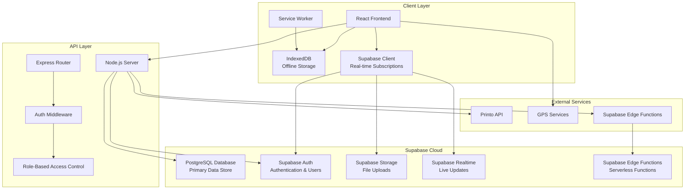
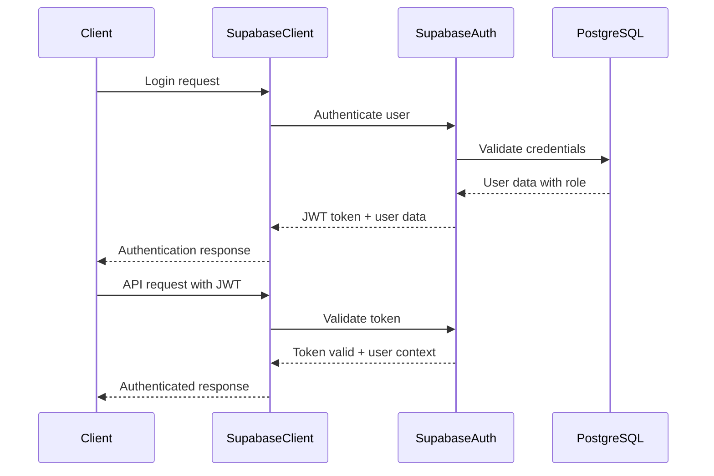

# System Architecture

## Overview

RiderPro is a modern, cloud-first delivery management and GPS tracking system built with React, TypeScript, and Node.js. The system leverages Supabase as the primary database backend with PostgreSQL, providing comprehensive route tracking, analytics, and real-time monitoring capabilities with integrated authentication and real-time subscriptions.

## High-Level Architecture



## Frontend Architecture

### Component Structure

```
src/
├── components/           # Reusable UI components
│   ├── ui/              # Base UI components (shadcn/ui)
│   ├── analytics/       # Analytics-specific components
│   ├── ErrorBoundary.tsx
│   ├── FloatingActionMenu.tsx
│   ├── RouteSessionControls.tsx
│   └── ShipmentCardWithTracking.tsx
├── pages/               # Page components
│   ├── Dashboard.tsx
│   ├── ShipmentsWithTracking.tsx
│   ├── RouteAnalytics.tsx
│   └── RouteVisualizationPage.tsx
├── hooks/               # Custom React hooks
│   ├── useAuth.ts
│   ├── useRouteAPI.ts
│   ├── useGPSTracking.ts
│   └── useMobileOptimization.ts
├── services/            # Business logic services
│   ├── AuthService.ts
│   ├── ApiClient.ts
│   ├── OfflineStorageService.ts
│   └── GPSTrackingService.ts
├── contexts/            # React contexts
│   ├── AuthContext.tsx
│   └── ThemeContext.tsx
└── api/                 # API integration
    ├── shipments.ts
    ├── routes.ts
    └── analytics.ts
```

### State Management

#### Authentication State
```typescript
interface AuthState {
  isAuthenticated: boolean;
  user: User | null;
  accessToken: string | null;
  refreshToken: string | null;
  isLoading: boolean;
}
```

#### GPS Tracking State
```typescript
interface GPSState {
  currentPosition: Position | null;
  isTracking: boolean;
  accuracy: number;
  lastUpdate: Date | null;
  sessionId: string | null;
}
```

### Offline-First Design

#### Service Worker Strategy
```typescript
// Service worker for offline functionality
self.addEventListener('fetch', (event) => {
  if (event.request.url.includes('/api/')) {
    event.respondWith(
      fetch(event.request)
        .catch(() => caches.match(event.request))
    );
  }
});
```

#### IndexedDB Schema
```typescript
interface OfflineStorage {
  gpsPoints: {
    id: string;
    sessionId: string;
    latitude: number;
    longitude: number;
    timestamp: string;
    accuracy: number;
    synced: boolean;
  };
  
  shipmentEvents: {
    id: string;
    shipmentId: string;
    eventType: 'pickup' | 'delivery';
    latitude: number;
    longitude: number;
    timestamp: string;
    synced: boolean;
  };
  
  syncQueue: {
    id: string;
    endpoint: string;
    method: string;
    data: any;
    timestamp: string;
    retryCount: number;
  };
}
```

### UI/UX Enhancements (Latest)

#### Responsive Design System
- **Mobile-First Approach**: All components optimized for mobile devices
- **Breakpoint Strategy**: `sm:`, `lg:`, `xl:` responsive breakpoints using Tailwind CSS
- **Touch-Friendly**: Minimum 44px touch targets for mobile interactions
- **Adaptive Layouts**: Grid systems that stack on mobile, expand on desktop

#### Interactive Analytics
- **Pie Chart Visualization**: `StatusDistributionPieChart.tsx` with hover effects and percentages
- **Real-time Updates**: Live data refresh with smooth animations and transitions
- **Color-Coded Status**: Intuitive color schemes for different shipment statuses
- **Empty States**: Graceful handling of no-data scenarios with helpful messages

#### Advanced Status Management
- **Footer-Style Actions**: Fixed action buttons at bottom of modals for better UX
- **Context-Aware Buttons**: Different actions based on shipment type and current status
- **GPS Integration**: Automatic location recording with visual feedback (blinking icons)
- **Access Control**: Role-based visibility for sensitive operations (super user only)

#### Mobile Optimization
- **Tab Navigation**: Mobile-responsive tabs that stack vertically on small screens
- **Touch Interactions**: Optimized button sizes and spacing for mobile devices
- **Performance**: Lazy loading and efficient rendering for mobile performance

## Authentication Architecture

### Supabase Authentication Integration

RiderPro leverages Supabase Auth for comprehensive authentication management:

#### Authentication Methods
- **Supabase Auth**: Primary authentication system with JWT tokens
- **External API Integration**: Printo API for enterprise users
- **Local Database Fallback**: SQLite for offline authentication
- **Real-time Sessions**: Live session management with Supabase Realtime

#### Authentication Flow


#### Role-Based Access Control
- **Super User**: `role = 'super_user'` or `'admin'` → Full system access
- **Ops Team**: `role = 'ops_team'` → Management-level access
- **Staff**: `role = 'staff'` → Limited management access
- **Driver**: `role = 'driver'` or default → Basic driver access

#### Database Efficiency
- **No Token Storage**: Tokens stored only in localStorage
- **Single Source of Truth**: User data in `userdata.db` only
- **Role-Based Permissions**: No additional boolean columns needed
- **Simplified Schema**: Uses existing `role` column for all permissions

### Fuel Settings Management

RiderPro includes a comprehensive fuel price management system for accurate route cost calculations:

#### Fuel Settings Features
- **Multi-Fuel Support**: Petrol, diesel, electric, and hybrid fuel types
- **Regional Pricing**: Support for different pricing by region (Bangalore, Chennai, Gurgaon, Hyderabad, Pune)
- **Currency Support**: INR currency with fixed pricing (USD support available)
- **Price History**: Effective date tracking for price changes over time
- **Active Management**: Enable/disable pricing settings without deletion

#### Admin Interface
- **Fuel Settings Modal**: Complete CRUD operations for fuel pricing
- **Current Settings Display**: Real-time view of active fuel prices with retry functionality
- **Regional Management**: Easy switching between different regional pricing
- **Price Validation**: Input validation for price and date fields
- **Enhanced User Management**: 
  - Conditional display of pending user approvals section
  - Separate "All Users Management" section with integrated refresh functionality
  - Improved visual hierarchy with color-coded sections
  - Better loading states and error handling

#### Integration with Route Analytics
- **Cost Calculations**: Automatic fuel cost calculations for route analysis
- **Vehicle Integration**: Links with vehicle types for accurate fuel efficiency calculations
- **Analytics Enhancement**: Provides accurate cost data for route optimization

## Backend Architecture

### Server Structure

```
server/
├── index.ts             # Main server entry point
├── routes.ts            # API route definitions
├── middleware/          # Express middleware
│   ├── auth.ts         # Authentication middleware
│   ├── cors.ts         # CORS configuration
│   └── rateLimit.ts    # Rate limiting
├── services/           # Business logic services
│   ├── AuthService.ts
│   ├── ShipmentService.ts
│   └── GPSService.ts
└── supabase/           # Supabase integration
    ├── client.ts       # Supabase client configuration
    ├── auth.ts         # Authentication helpers
    └── realtime.ts     # Real-time subscriptions
```

### API Design Patterns

#### RESTful Endpoints
```typescript
// Shipments API
GET    /api/shipments/fetch     # List shipments (paginated)
POST   /api/shipments/receive   # Receive external shipment data
GET    /api/shipments/:id       # Get single shipment
PUT    /api/shipments/:id       # Update shipment
DELETE /api/shipments/:id       # Delete shipment
PATCH  /api/shipments/batch     # Batch update

// Route Sessions API
POST   /api/routes/sessions     # Start route session
GET    /api/routes/sessions/:id # Get session details
PUT    /api/routes/sessions/:id/stop # Stop session
POST   /api/routes/sessions/:id/points # Record GPS point
```

#### Middleware Pipeline
```typescript
app.use(cors());
app.use(rateLimit());
app.use(express.json());
app.use('/api', authMiddleware);
app.use('/api', routeHandler);
app.use(errorHandler);
```

## GPS Tracking System

### Real-Time GPS Collection

```typescript
class GPSTrackingService {
  private watchId: number | null = null;
  private sessionId: string | null = null;
  
  startTracking(sessionId: string): void {
    this.sessionId = sessionId;
    this.watchId = navigator.geolocation.watchPosition(
      this.handlePositionUpdate.bind(this),
      this.handlePositionError.bind(this),
      {
        enableHighAccuracy: true,
        timeout: 30000,
        maximumAge: 0
      }
    );
  }
  
  private async handlePositionUpdate(position: GeolocationPosition): Promise<void> {
    const gpsPoint = {
      sessionId: this.sessionId!,
      latitude: position.coords.latitude,
      longitude: position.coords.longitude,
      accuracy: position.coords.accuracy,
      speed: position.coords.speed,
      heading: position.coords.heading,
      timestamp: new Date().toISOString()
    };
    
    // Store locally first
    await this.offlineStorage.storeGPSPoint(gpsPoint);
    
    // Try to sync immediately
    try {
      await this.syncGPSPoint(gpsPoint);
    } catch (error) {
      // Will be synced later by background process
      console.log('GPS point queued for later sync');
    }
  }
}
```

### Smart Route Completion

```typescript
class SmartRouteCompletion {
  private config = {
    completionRadius: 100, // meters
    minDuration: 1800,     // 30 minutes
    autoConfirmDelay: 30   // seconds
  };
  
  detectCompletion(
    startPosition: Position,
    currentPosition: Position,
    sessionDuration: number
  ): boolean {
    const distance = this.calculateDistance(startPosition, currentPosition);
    
    return distance <= this.config.completionRadius &&
           sessionDuration >= this.config.minDuration;
  }
}
```

## Data Synchronization

### Sync Strategy

```typescript
class SyncService {
  private syncQueue: SyncItem[] = [];
  private isOnline = navigator.onLine;
  
  async syncPendingData(): Promise<void> {
    if (!this.isOnline) return;
    
    const pendingItems = await this.offlineStorage.getPendingSyncItems();
    
    for (const item of pendingItems) {
      try {
        await this.syncItem(item);
        await this.offlineStorage.markAsSynced(item.id);
      } catch (error) {
        await this.handleSyncError(item, error);
      }
    }
  }
  
  private async handleSyncError(item: SyncItem, error: Error): Promise<void> {
    item.retryCount++;
    
    if (item.retryCount >= 3) {
      await this.offlineStorage.markAsFailed(item.id);
    } else {
      // Exponential backoff
      const delay = Math.pow(2, item.retryCount) * 1000;
      setTimeout(() => this.syncItem(item), delay);
    }
  }
}
```

### Conflict Resolution

```typescript
interface ConflictResolution {
  strategy: 'client-wins' | 'server-wins' | 'merge' | 'manual';
  
  resolveShipmentConflict(
    clientData: Shipment,
    serverData: Shipment
  ): Shipment {
    // GPS data: client wins (more recent)
    if (clientData.latitude && clientData.longitude) {
      return { ...serverData, ...clientData };
    }
    
    // Status updates: server wins (authoritative)
    return { ...clientData, status: serverData.status };
  }
}
```

## Authentication Integration

### External API Integration

```typescript
class AuthService {
  private readonly PRINTO_API_BASE = 'https://pia.printo.in/api/v1';
  
  async authenticateWithPrinto(
    employeeId: string,
    password: string
  ): Promise<AuthResponse> {
    const response = await fetch(`${this.PRINTO_API_BASE}/auth/`, {
      method: 'POST',
      headers: { 'Content-Type': 'application/json' },
      body: JSON.stringify({
        employee_id: employeeId,
        password: password
      })
    });
    
    if (!response.ok) {
      throw new AuthError('Invalid credentials');
    }
    
    const data = await response.json();
    return this.createUserFromPrintoResponse(data, employeeId);
  }
  
  private createUserFromPrintoResponse(
    data: PrintoAuthResponse,
    employeeId: string
  ): AuthResponse {
    const user: User = {
      id: employeeId,
      username: employeeId,
      employeeId: employeeId,
      email: employeeId,
      fullName: data.full_name || employeeId,
      role: data.is_ops_team ? UserRole.OPS_TEAM : UserRole.DRIVER,
      isActive: true,
      permissions: [],
      isOpsTeam: data.is_ops_team || false,
      isSuperUser: data.is_super_user || false,
      isStaff: data.is_staff || false
    };
    
    return {
      success: true,
      accessToken: data.access,
      refreshToken: data.refresh,
      user
    };
  }
}
```

## Performance Optimizations

### Mobile Optimizations

```typescript
class MobileOptimization {
  private batteryLevel = 1.0;
  private isLowPowerMode = false;
  
  optimizeForBattery(): OptimizationSettings {
    if (this.batteryLevel < 0.2 || this.isLowPowerMode) {
      return {
        gpsInterval: 60000,      // 1 minute instead of 30 seconds
        syncInterval: 300000,    // 5 minutes instead of 1 minute
        reduceAnimations: true,
        disableBackgroundSync: true
      };
    }
    
    return {
      gpsInterval: 30000,
      syncInterval: 60000,
      reduceAnimations: false,
      disableBackgroundSync: false
    };
  }
}
```

### Caching Strategy

```typescript
class CacheManager {
  private memoryCache = new Map<string, CacheItem>();
  private readonly TTL = 5 * 60 * 1000; // 5 minutes
  
  async get<T>(key: string, fetcher: () => Promise<T>): Promise<T> {
    const cached = this.memoryCache.get(key);
    
    if (cached && Date.now() - cached.timestamp < this.TTL) {
      return cached.data;
    }
    
    const data = await fetcher();
    this.memoryCache.set(key, {
      data,
      timestamp: Date.now()
    });
    
    return data;
  }
}
```

## Security Architecture

### Authentication Flow

```typescript
// JWT token validation middleware
const authMiddleware = async (req: Request, res: Response, next: NextFunction) => {
  const token = req.headers.authorization?.replace('Bearer ', '');
  
  if (!token) {
    return res.status(401).json({ error: 'No token provided' });
  }
  
  try {
    // Verify with Printo API
    const response = await fetch('https://pia.printo.in/api/v1/auth/me/', {
      headers: { 'Authorization': `Bearer ${token}` }
    });
    
    if (!response.ok) {
      return res.status(401).json({ error: 'Invalid token' });
    }
    
    const userData = await response.json();
    req.user = userData;
    next();
  } catch (error) {
    return res.status(401).json({ error: 'Token validation failed' });
  }
};
```

### Role-Based Access Control

```typescript
const requireRole = (requiredRole: UserRole) => {
  return (req: Request, res: Response, next: NextFunction) => {
    if (!req.user || req.user.role !== requiredRole) {
      return res.status(403).json({ error: 'Insufficient permissions' });
    }
    next();
  };
};

// Usage
app.get('/api/analytics', authMiddleware, requireRole(UserRole.OPS_TEAM), analyticsHandler);
```

## Monitoring and Logging

### Error Tracking

```typescript
class ErrorMonitor {
  logError(error: Error, context: ErrorContext): void {
    const errorData = {
      message: error.message,
      stack: error.stack,
      timestamp: new Date().toISOString(),
      userId: context.userId,
      route: context.route,
      userAgent: context.userAgent
    };
    
    // Log to console in development
    if (process.env.NODE_ENV === 'development') {
      console.error('Error:', errorData);
    }
    
    // Send to monitoring service in production
    if (process.env.NODE_ENV === 'production') {
      this.sendToMonitoringService(errorData);
    }
  }
}
```

### Performance Monitoring

```typescript
class PerformanceMonitor {
  trackAPICall(endpoint: string, duration: number, success: boolean): void {
    const metric = {
      endpoint,
      duration,
      success,
      timestamp: Date.now()
    };
    
    // Store metrics for analytics
    this.storeMetric(metric);
    
    // Alert on slow requests
    if (duration > 5000) {
      this.alertSlowRequest(metric);
    }
  }
}
```

## Supabase Integration

### Database Configuration

RiderPro uses Supabase as the primary database backend with PostgreSQL:

#### Supabase Client Setup
```typescript
import { createClient } from '@supabase/supabase-js'

const supabaseUrl = process.env.VITE_SUPABASE_URL
const supabaseKey = process.env.VITE_SUPABASE_ANON_KEY

export const supabase = createClient(supabaseUrl, supabaseKey, {
  auth: {
    autoRefreshToken: true,
    persistSession: true,
    detectSessionInUrl: true
  },
  realtime: {
    params: {
      eventsPerSecond: 10
    }
  }
})
```

#### Real-time Subscriptions
```typescript
// Subscribe to shipment updates
const subscription = supabase
  .channel('shipments')
  .on('postgres_changes', 
    { event: '*', schema: 'public', table: 'shipments' },
    (payload) => {
      console.log('Shipment updated:', payload)
      // Update UI with real-time data
    }
  )
  .subscribe()
```

#### Authentication Integration
```typescript
// Sign in with Supabase Auth
const { data, error } = await supabase.auth.signInWithPassword({
  email: 'user@example.com',
  password: 'password'
})

// Get current user
const { data: { user } } = await supabase.auth.getUser()

// Sign out
await supabase.auth.signOut()
```

### File Storage
```typescript
// Upload files to Supabase Storage
const { data, error } = await supabase.storage
  .from('shipment-files')
  .upload('signatures/signature-123.png', file)

// Download files
const { data } = supabase.storage
  .from('shipment-files')
  .getPublicUrl('signatures/signature-123.png')
```

## Deployment Architecture

### Development Environment
```bash
# Frontend (Vite dev server)
npm run dev              # http://localhost:5000

# Backend (Node.js)
npm run server          # http://localhost:5000/api

# Supabase Local Development
supabase start          # Start local Supabase instance
supabase db reset       # Reset local database

# External API
# https://pia.printo.in/api/v1
```

### Production Environment
```bash
# Build process
npm run build           # Build React app
npm run build:server    # Build Node.js server

# Supabase deployment
supabase db push        # Deploy schema changes
supabase functions deploy # Deploy edge functions

# Application deployment
docker build -t riderpro .
docker run -p 80:5000 riderpro
```

### Environment Configuration

```bash
# Client environment variables
VITE_API_BASE_URL=https://api.riderpro.com
VITE_AUTH_BASE_URL=https://pia.printo.in/api/v1
VITE_SUPABASE_URL=https://your-project.supabase.co
VITE_SUPABASE_ANON_KEY=your-anon-key
VITE_GPS_UPDATE_INTERVAL=30000
VITE_SYNC_INTERVAL=60000

# Server environment variables
NODE_ENV=production
PORT=5000
PRINTO_API_BASE_URL=https://pia.printo.in/api/v1
SUPABASE_URL=https://your-project.supabase.co
SUPABASE_SERVICE_ROLE_KEY=your-service-role-key
CORS_ORIGINS=https://riderpro.com,https://app.riderpro.com
RATE_LIMIT_WINDOW=900000
RATE_LIMIT_MAX=100
```

## Scalability Considerations

### Horizontal Scaling
- Stateless server design with Supabase backend
- JWT tokens with Supabase Auth
- Automatic database connection pooling via Supabase
- Load balancer ready with CDN integration

### Data Growth
- Pagination for all list endpoints
- Supabase automatic scaling and optimization
- Efficient PostgreSQL indexing
- Real-time data streaming with Supabase Realtime

### Performance Bottlenecks
- GPS point ingestion with rate limiting
- Batch processing for sync operations
- Supabase caching and CDN for static assets
- Edge functions for compute-intensive tasks

## Future Enhancements

### Planned Features
1. **Advanced Analytics**: Machine learning insights with Supabase ML
2. **Multi-tenant Support**: Multiple organizations with RLS
3. **Mobile App**: Native iOS/Android apps with Supabase
4. **Edge Functions**: Serverless compute for complex operations
5. **Advanced Caching**: Redis integration for high-performance queries

### Technical Improvements
1. **Database Optimization**: Advanced PostgreSQL features and indexing
2. **Microservices**: Edge functions for specific business logic
3. **Event Sourcing**: Audit trail with Supabase Realtime
4. **GraphQL**: Supabase GraphQL API integration
5. **Kubernetes**: Container orchestration with Supabase Edge Functions